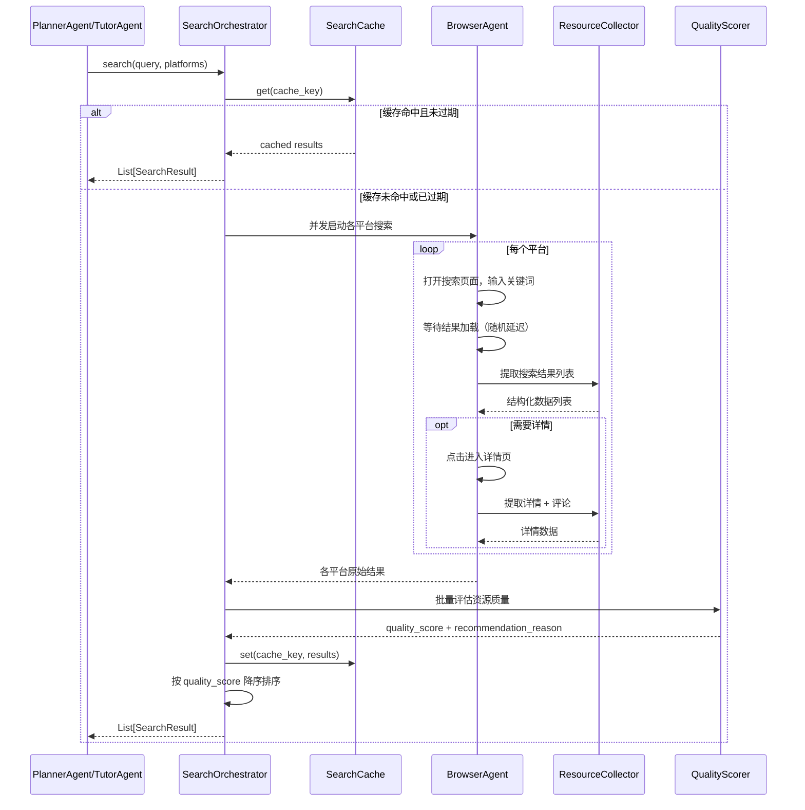
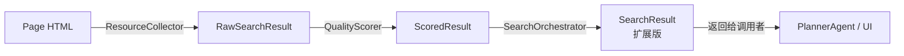

# 设计文档：智能浏览器 Agent 资源搜索

## 概述

本设计将现有的 `ResourceSearcher`（基于 httpx API 调用）替换为基于 Playwright + LLM 的智能浏览器 Agent 架构。新系统通过真实浏览器模拟人类浏览行为，在六大平台（小红书、Bilibili、YouTube、GitHub、Google、微信公众号）上搜索学习资源，并利用 LLM 对内容进行多维度质量评估。

### 设计目标

- 保持与现有 `ResourceSearcher.search()` 接口完全兼容，PlannerAgent 和 TutorAgent 无需修改调用代码
- 用 Playwright 浏览器替代 httpx API 调用，绕过 API 限制
- 引入 LLM 质量评估，为每条资源生成 quality_score 和推荐理由
- 支持搜索结果缓存，减少重复搜索
- 扩展 SearchResult 模型，向后兼容

### 关键设计决策

1. **使用 Playwright 而非 browser-use**：Playwright 是成熟的浏览器自动化库，社区活跃，文档完善，且项目已使用 Python 生态，Playwright 的 Python 绑定（playwright-python）集成简单。browser-use 虽然封装了 LLM + 浏览器的交互，但引入额外抽象层，调试困难，且对中文平台支持未经验证。
2. **异步架构**：Playwright 原生支持 async/await，多平台并发搜索天然适合异步模型。在 `search()` 入口处使用 `asyncio.run()` 包装，保持同步接口不变。
3. **平台配置驱动**：每个平台的搜索逻辑通过 `PlatformConfig` 数据类配置（URL 模板、CSS 选择器、资源类型映射），新增平台只需添加配置，无需修改核心逻辑。
4. **LLM 评估与搜索解耦**：Quality_Scorer 作为独立组件，接收结构化数据后调用 LLM 评估，不依赖浏览器状态。
5. **Cookie 登录而非无痕模式**：POC 验证发现小红书搜索和详情页均需要登录态，无痕模式会被重定向到首页。采用 Cookie 持久化方案（首次手动登录保存 cookie，后续自动复用）。
6. **JS 整体提取而非 CSS 选择器逐个查找**：小红书前端使用动态 class 名和 Vue 组件，固定 CSS 选择器不可靠。改用 JS evaluate 在页面内一次性提取所有数据，更稳定。
7. **详情页必须使用带 xsec_token 的原始链接**：小红书详情页需要搜索结果中的 xsec_token 参数，自行拼接 `/explore/` 链接会返回 404。
8. **混合方案（浏览器 + API 响应拦截）而非纯 API 调用**：POC 验证发现纯 API 方案（httpx 直接调用 `edith.xiaohongshu.com`）会被反爬拦截（错误码 300011 "账号异常"），因为 API 需要 `X-S`、`X-T`、`X-S-Common` 等动态签名 header。混合方案用 Playwright 浏览器执行搜索（浏览器自带签名），通过 `page.on("response")` 拦截 API 响应获取结构化 JSON 数据，兼具浏览器的稳定性和 API 的数据完整性。
9. **详情页正文通过 `__INITIAL_STATE__` 内嵌 JSON 提取**：详情页的 feed API 响应未被拦截器捕获（可能是 SSR 渲染），但页面 HTML 中内嵌了 `__INITIAL_STATE__` 全局变量，包含完整的笔记数据。通过 JS evaluate 解析该变量可 100% 提取正文内容，比 CSS 选择器更可靠。
10. **详情页并行获取（3 tab 并发）而非串行逐个打开**：POC 验证 10 条详情串行耗时 174 秒（~17s/条），20 条将超过 5 分钟。改用 asyncio.Semaphore 控制最多 3 个 tab 并发加载详情页，理论上将 20 条详情耗时压缩到 ~120 秒。每个 tab 独立注册 API 响应拦截器，互不干扰。
11. **搜索全量获取（60 条）+ 详情 top 20**：搜索阶段通过滚动加载获取全部 ~60 条结果（仅需 API 拦截，无额外页面打开），详情页获取仅针对综合分排名前 20 的结果。搜索阶段已有精确互动数据，详情页主要补充正文和评论。
12. **多模态图像理解接口预留**：小红书大量内容以图片形式呈现（学习路线图、思维导图、代码截图等），MVP 阶段预留 `extract_image_content()` 接口和数据模型字段（`image_urls`、`image_descriptions`），但不实现图像下载和多模态 LLM 调用。未来启用时，下载前 3 张图片送多模态 LLM（如 GPT-4o）做内容理解。
13. **多关键词搜索接口预留**：MVP 阶段仅支持单关键词搜索，预留 `expand_keywords()` 接口。未来启用时，使用 LLM 根据用户主题自动扩展 2-3 个相关关键词（如 "langchain" → ["langchain agent应用", "langchain RAG实战", "langchain 教程"]），多关键词结果按 note_id 去重合并。

### POC 验证结果（小红书平台）

三个 POC 脚本已在小红书平台上验证通过：

#### POC 1: 纯浏览器方案 (`scripts/poc_browser_search.py`)
- Playwright + Cookie 登录可以正常访问小红书搜索页和详情页
- 搜索结果通过 JS evaluate 提取，按笔记 ID 去重
- 详情页成功率约 33%（5 条中 2 条成功），受页面加载和登录弹窗影响
- 评论区可提取高赞评论，但成功率约 60%
- 耗时约 36 秒，15 条结果

#### POC 2: 纯 API 方案 (`scripts/poc_xhs_api.py`)
- 使用 httpx 直接调用 `edith.xiaohongshu.com` API
- **失败**：返回错误码 300011 "当前账号存在异常，请切换账号后重试"
- 原因：API 需要 `X-S`、`X-T`、`X-S-Common` 等动态签名 header，仅有 Cookie 不够
- 结论：纯 API 方案不可行，除非逆向签名算法

#### POC 3: 混合方案 (`scripts/poc_xhs_hybrid.py`) ✅ 推荐方案
- 用 Playwright 浏览器执行搜索（自带签名），通过 `page.on("response")` 拦截 API 响应
- 搜索数据：拦截 `/api/sns/web/v1/search/notes` 响应，获取 60 条结构化 JSON 结果
- 评论数据：拦截 `/api/sns/web/v2/comment/page` 响应，100% 成功率
- 正文数据：从详情页 `__INITIAL_STATE__` 内嵌 JSON 提取，100% 成功率
- 互动数据精确到个位数（如 13265 而非 "1.3万"）
- 还顺便捕获了 `x-s`, `x-t`, `x-s-common` 签名 headers（未来可用于纯 API 调用）
- 耗时约 80 秒（因结果多 4 倍），60 条结果

#### 三方案对比

| 指标 | 纯浏览器 | 纯 API | 混合方案 |
|------|---------|--------|---------|
| 搜索结果数 | 15 条 | ❌ 被拦截 | 60 条 |
| 互动数据精度 | 字符串 ("1.3万") | - | 精确数字 (13265) |
| 详情正文成功率 | 33% | - | 100%（两次验证均 10/10） |
| 评论获取成功率 | 60% | - | 100%（两次验证均 10/10） |
| 数据来源 | CSS 选择器 | - | API JSON + DOM |
| 需要签名逆向 | 否 | 是 | 否 |
| 耗时（5 条详情） | ~36s | - | ~80s |
| 耗时（10 条详情） | - | - | ~174s |

#### 关键限制与问题
- **必须登录**：搜索和详情页均需登录态，建议用小号
- **详情页仍需逐个打开**：正文提取需要打开详情页（通过 `__INITIAL_STATE__`），但评论通过 API 拦截获取
- **耗时较长**：60 条结果 + 5 条详情约 80 秒，10 条详情约 174 秒，耗时与详情页数量近似线性增长

#### 实际数据样本

**测试 1：搜索 "GRE 备考"（初始验证）**
- 60 条去重结果（3 页滚动加载）
- 最高综合分 56627（三周低强度速通GRE330，👍13265 ⭐21345 💬224）
- 高赞评论质量很高（如 168 赞的评论 "今早327拿下了 感谢姐"）
- 评论区的高赞回答往往比正文更有学习参考价值

**测试 2：搜索 "agent开发"（二次验证，`scripts/poc_xhs_test2.py`）**
- 60 条去重结果，10 条详情全部成功提取（10/10 正文 + 10/10 评论），耗时 174.4 秒
- 综合分排序有效：最高 6737（零基础到大厂—AI应用开发篇，💬152 ⭐2511 👍1259）
- 高赞评论极具学习价值，例如：
  - [168赞] "一面问后端（微服务数据库redis消息队列），二面问agent（mcp、langgraph、多智能体协作...）"
  - [41赞] "现阶段 agent 开发其实更偏重后端一些，AI（算法）反而没那么重要"
  - [37赞] "token不得爆炸了"
- 内容类型多样：面经分享、学习路线、项目推荐、实战反思、行业讨论
- 验证了评论数×5 + 收藏数×2 + 点赞数的排序公式能有效将高讨论度内容排在前面
- 结果保存于 `scripts/xhs_agent_results.json`，报告见 `scripts/xhs_agent_report.md`

## 架构

### 整体架构图

```mermaid
graph TB
    subgraph 调用层
        PA[PlannerAgent]
        TA[TutorAgent]
    end

    subgraph BrowserResourceSearcher
        SO[SearchOrchestrator<br/>搜索调度器]
        Cache[SearchCache<br/>本地缓存]
        
        subgraph 浏览器层
            BA[BrowserAgent<br/>浏览器引擎]
            AI[APIInterceptor<br/>API 响应拦截]
            RC[ResourceCollector<br/>数据采集]
        end
        
        subgraph 平台配置
            PC1[小红书 Config<br/>混合模式]
            PC2[Bilibili Config]
            PC3[YouTube Config]
            PC4[GitHub Config]
            PC5[Google Config]
            PC6[微信 Config]
        end
        
        QS[QualityScorer<br/>LLM 质量评估]
    end

    PA -->|search\(query, platforms\)| SO
    TA -->|search\(query, platforms\)| SO
    SO --> Cache
    Cache -->|缓存命中| SO
    Cache -->|缓存未命中| BA
    BA --> PC1 & PC2 & PC3 & PC4 & PC5 & PC6
    BA --> AI
    AI -->|拦截 API JSON| RC
    BA --> RC
    RC -->|结构化数据| QS
    QS -->|评分 + 推荐理由| SO
    SO -->|排序后的 SearchResult 列表| PA
    SO -->|排序后的 SearchResult 列表| TA
```

### 搜索流程时序图



## 组件与接口

### 1. BrowserResourceSearcher（主入口）

替换现有 `ResourceSearcher`，保持相同的公开接口。

```python
class BrowserResourceSearcher:
    """基于浏览器 Agent 的资源搜索器，替代原有 ResourceSearcher"""
    
    PLATFORMS = ["bilibili", "youtube", "google", "github", "xiaohongshu", "wechat"]
    TIMEOUT = 60  # 总超时时间（秒）
    DEFAULT_TOP_K = 10  # 默认返回前 10 条
    
    def __init__(self):
        self._orchestrator = SearchOrchestrator()
    
    def search(self, query: str, platforms: Optional[List[str]] = None) -> List[SearchResult]:
        """
        搜索学习资源（保持与原 ResourceSearcher.search 相同的签名）
        
        Args:
            query: 搜索关键词
            platforms: 指定平台列表，默认全部 6 个平台
        Returns:
            按 quality_score 降序排列的 SearchResult 列表
        """
        ...
```

**文件位置**：`src/specialists/resource_searcher.py`（替换原有类）

### 2. SearchOrchestrator（搜索调度器）

协调多平台并发搜索、缓存管理和结果聚合。

```python
class SearchOrchestrator:
    """协调多平台搜索任务"""
    
    def __init__(self, cache_ttl: int = 3600):
        self._cache = SearchCache(ttl=cache_ttl)
        self._browser_agent = BrowserAgent()
        self._quality_scorer = QualityScorer()
    
    async def search_all_platforms(
        self, query: str, platforms: List[str], timeout: float = 60.0, top_k: int = 10
    ) -> List[SearchResult]:
        """并发搜索所有指定平台，聚合、评分、排序后返回"""
        ...
    
    async def _search_single_platform(
        self, query: str, platform: str
    ) -> List[SearchResult]:
        """搜索单个平台"""
        ...
    
    def expand_keywords(self, query: str) -> List[str]:
        """[TODO: 未来实现] 使用 LLM 根据用户主题扩展 2-3 个相关搜索关键词。
        MVP 阶段返回 [query]（原始单关键词）。
        示例：'langchain' → ['langchain agent应用', 'langchain RAG实战', 'langchain 教程']"""
        return [query]
```

**文件位置**：`src/specialists/search_orchestrator.py`

### 3. BrowserAgent（浏览器引擎）

管理 Playwright 浏览器实例，执行页面操作，支持 API 响应拦截。

```python
class BrowserAgent:
    """基于 Playwright 的浏览器代理，支持混合模式（浏览器 + API 拦截）"""
    
    PAGE_TIMEOUT = 15_000  # 页面加载超时（毫秒）
    MIN_DELAY = 1.0  # 最小操作间隔（秒）
    MAX_DELAY = 3.0  # 最大操作间隔（秒）
    MIN_PLATFORM_INTERVAL = 2.0  # 同平台最小请求间隔（秒）
    DETAIL_MAX_RETRIES = 2  # 详情页最大重试次数
    DETAIL_CONCURRENCY = 3  # 详情页并行获取的最大 tab 数
    SEARCH_FULL_COUNT = 60  # 搜索全量获取数（滚动加载）
    DETAIL_TOP_K = 20  # 获取详情的 top K 条结果
    
    def __init__(self):
        self._intercepted_search: List[dict] = []  # 拦截到的搜索 API 响应
        self._intercepted_comments: Dict[str, List[dict]] = {}  # note_id → 评论
        self._intercepted_details: Dict[str, dict] = {}  # note_id → 详情
        self._captured_headers: Dict[str, str] = {}  # 捕获的签名 headers
    
    async def launch(self, config: PlatformConfig) -> None:
        """启动浏览器实例（带反检测配置），如需登录则加载 Cookie"""
        ...
    
    async def search_platform(
        self, query: str, config: PlatformConfig
    ) -> List[RawSearchResult]:
        """在指定平台执行搜索，返回原始结果。
        对于 use_hybrid_mode=True 的平台，注册 API 响应拦截器，
        从拦截到的 JSON 中提取结构化数据。
        搜索阶段全量获取（~60 条），通过多次滚动触发分页 API。"""
        ...
    
    async def fetch_details_parallel(
        self, notes: List[RawSearchResult], config: PlatformConfig, top_k: int = 20
    ) -> List[RawSearchResult]:
        """并行获取 top_k 条结果的详情页（正文 + 评论）。
        使用 asyncio.Semaphore 控制最多 DETAIL_CONCURRENCY 个 tab 并发。
        每个 tab 独立注册 API 响应拦截器。"""
        ...
    
    async def fetch_detail(
        self, url: str, config: PlatformConfig, retry: int = 0
    ) -> Optional[ResourceDetail]:
        """进入详情页提取内容和评论，支持重试。
        优先使用拦截到的 API 数据，回退到 __INITIAL_STATE__ 或 DOM 提取。"""
        ...
    
    async def extract_image_content(
        self, image_urls: List[str], max_images: int = 3
    ) -> List[str]:
        """[TODO: 未来实现] 下载前 max_images 张图片，调用多模态 LLM 提取图片内容。
        MVP 阶段返回空列表。"""
        return []
    
    async def _intercept_response(self, response) -> None:
        """API 响应拦截回调，提取搜索结果、详情和评论的 JSON 数据"""
        ...
    
    async def _intercept_request(self, route, request) -> None:
        """请求拦截回调，捕获签名 headers（x-s, x-t, x-s-common）"""
        ...
    
    async def _extract_content_from_page(self, page) -> str:
        """从详情页提取正文：优先 __INITIAL_STATE__ JSON，回退 DOM 选择器"""
        ...
    
    async def ensure_logged_in(self, page, config: PlatformConfig) -> bool:
        """检查登录状态，如需重新登录则提示用户"""
        ...
    
    async def close(self) -> None:
        """关闭浏览器实例，保存 Cookie，释放资源"""
        ...
```

**文件位置**：`src/specialists/browser_agent.py`

### 4. ResourceCollector（数据采集）

从 Playwright Page 对象中提取结构化数据。

```python
class ResourceCollector:
    """从浏览器页面提取结构化资源数据"""
    
    @staticmethod
    async def extract_search_results(
        page: Page, config: PlatformConfig
    ) -> List[RawSearchResult]:
        """从搜索结果页提取结果列表"""
        ...
    
    @staticmethod
    async def extract_detail(
        page: Page, config: PlatformConfig
    ) -> ResourceDetail:
        """从详情页提取内容、互动指标和评论"""
        ...
```

**文件位置**：`src/specialists/resource_collector.py`

### 5. QualityScorer（LLM 质量评估）

使用 LLM 对资源进行多维度质量评估。

```python
class QualityScorer:
    """使用 LLM 进行资源质量评估"""
    
    DIMENSIONS = ["engagement", "depth", "comments", "freshness"]
    
    async def score_batch(
        self, results: List[RawSearchResult]
    ) -> List[ScoredResult]:
        """批量评估资源质量，返回带评分的结果"""
        ...
    
    def _build_scoring_prompt(self, result: RawSearchResult) -> str:
        """构建 LLM 评分 prompt"""
        ...
    
    def _parse_score_response(self, response: str) -> Tuple[float, str]:
        """解析 LLM 返回的评分和推荐理由"""
        ...
```

**文件位置**：`src/specialists/quality_scorer.py`

### 6. SearchCache（搜索缓存）

基于内存的搜索结果缓存。

```python
class SearchCache:
    """搜索结果本地缓存"""
    
    def __init__(self, ttl: int = 3600):
        self._ttl = ttl  # 缓存有效期（秒）
        self._store: Dict[str, Tuple[float, List[SearchResult]]] = {}
    
    def get(self, query: str, platforms: List[str]) -> Optional[List[SearchResult]]:
        """获取缓存结果，过期返回 None"""
        ...
    
    def set(self, query: str, platforms: List[str], results: List[SearchResult]) -> None:
        """设置缓存"""
        ...
    
    @staticmethod
    def _make_key(query: str, platforms: List[str]) -> str:
        """生成缓存键：query + sorted platforms 的哈希"""
        ...
```

**文件位置**：`src/specialists/search_cache.py`

### 7. PlatformConfig（平台配置）

每个平台的搜索配置数据类。

```python
@dataclass
class PlatformConfig:
    """平台搜索配置"""
    name: str                          # 平台名称
    search_url_template: str           # 搜索 URL 模板，{query} 为占位符
    result_selector: str               # 搜索结果列表的 CSS 选择器
    title_selector: str                # 标题的 CSS 选择器
    link_selector: str                 # 链接的 CSS 选择器
    description_selector: str          # 描述的 CSS 选择器
    resource_type: str                 # 默认资源类型
    detail_selectors: DetailSelectors  # 详情页选择器集合
    requires_login: bool = False       # 是否需要登录态
    cookie_file: str = ""              # Cookie 持久化文件路径
    use_js_extraction: bool = False    # 是否使用 JS 整体提取（替代 CSS 选择器）
    js_extract_fn: str = ""            # JS 提取函数代码（当 use_js_extraction=True 时使用）
    use_hybrid_mode: bool = False      # 是否使用混合模式（浏览器 + API 响应拦截）
    api_intercept_patterns: List[str] = field(default_factory=list)  # 需要拦截的 API URL 模式
    detail_extract_method: str = "css" # 详情页提取方式：css / js_state / api_intercept
    
@dataclass
class DetailSelectors:
    """详情页选择器"""
    content_selector: str = ""         # 正文内容选择器
    likes_selector: str = ""           # 点赞数选择器
    favorites_selector: str = ""       # 收藏数选择器
    comments_count_selector: str = ""  # 评论数选择器
    comment_item_selector: str = ""    # 单条评论选择器
    comment_likes_selector: str = ""   # 评论点赞数选择器（用于高赞评论排序）
    extra_metrics: Dict[str, str] = field(default_factory=dict)  # 平台特有指标选择器
    initial_state_path: str = ""       # __INITIAL_STATE__ 中正文数据的 JSON 路径
```

**文件位置**：`src/specialists/platform_configs.py`

### 8. 小红书平台优化方案（基于 POC 验证）

基于三个 POC 的实际测试结果，小红书平台采用混合方案（浏览器 + API 响应拦截）：

#### 8.1 混合模式架构
- 用 Playwright 浏览器执行搜索（浏览器自带 X-S/X-T 签名，不会被反爬拦截）
- 通过 `page.on("response")` 注册响应拦截器，捕获以下 API 响应：
  - `/api/sns/web/v1/search/notes` — 搜索结果（结构化 JSON，精确互动数据）
  - `/api/sns/web/v2/comment/page` — 评论数据（含评论点赞数）
  - `/api/sns/web/v1/feed` — 笔记详情（如果被拦截到）
- 通过 `page.route()` 注册请求拦截器，捕获签名 headers（x-s, x-t, x-s-common）供未来使用

#### 8.2 登录与 Cookie 管理
- 首次使用需手动登录（建议小号），Cookie 保存到 `scripts/.xhs_cookies.json`
- 每次搜索后自动更新 Cookie，保持登录态新鲜
- 搜索前检测登录状态（检查是否被重定向或出现登录弹窗），失效时提示重新登录

#### 8.3 搜索结果提取策略
- 搜索数据从拦截到的 API JSON 中提取，不依赖 CSS 选择器
- 多次滚动（至少 5 次，每次 800px）触发分页加载，拦截多页 API 响应，全量获取约 60 条结果
- 按笔记 ID（24 位十六进制）去重，保留 xsec_token
- 互动数据精确到个位数（API 返回 int 而非 "1.3万" 字符串）
- 搜索阶段已有完整互动数据，无需打开详情页即可排序

#### 8.4 详情页提取优化（三级回退策略）
1. **优先：API 拦截** — 如果 feed API 响应被拦截到，直接使用 JSON 数据
2. **回退：`__INITIAL_STATE__`** — 从详情页 HTML 中解析内嵌的全局 JSON 变量，提取正文
3. **兜底：DOM 选择器** — 使用 `#detail-desc`, `.note-text` 等选择器提取
- POC 验证：方法 2 成功率 100%（5/5），是最可靠的正文提取方式

#### 8.5 高赞评论提取（核心价值）
POC 验证发现评论区的高赞回答往往比正文更有学习参考价值，需要重点提取：
- 评论数据从拦截到的 `/api/sns/web/v2/comment/page` JSON 中提取，100% 成功率
- 评论去重：以前 30 字为指纹，跳过重复评论
- 广告评论过滤：包含 2 个及以上营销关键词（私信、加我、免费领、优惠券、微信等）的评论自动跳过
- 按评论点赞数降序排序，保留前 10 条高赞评论
- 高赞评论作为独立字段传递给 QualityScorer，影响质量评分

#### 8.6 质量排序策略
基于 POC 数据分析，小红书资源的价值排序权重：
```
综合分 = 评论数 × 5 + 收藏数 × 2 + 点赞数 × 1
```
- 评论数权重最高（×5）：评论多说明引发了讨论，内容有争议性或实用性，高赞评论往往比正文更有学习价值
- 收藏数次之：收藏代表用户认为内容有长期参考价值
- 点赞数最低：点赞门槛低，容易被标题党和广告内容刷高

#### 8.7 广告/低质内容过滤
- 标题包含明显广告关键词（"报班"、"课程优惠"、"限时"等）的结果降权
- 评论数为 0 且点赞数 < 50 的结果排到末尾
- 正文长度 < 50 字的结果标记为"浅内容"

#### 8.8 详情页并行获取优化
- 搜索阶段全量获取 ~60 条结果（仅 API 拦截，无额外页面打开，耗时 ~15s）
- 按综合分排序后，仅对 top 20 结果获取详情页（正文 + 评论）
- 使用 `asyncio.Semaphore(3)` 控制最多 3 个 tab 并发加载详情页
- 每个 tab 独立注册 `page.on("response")` 拦截器，评论数据互不干扰
- 预计 20 条详情并行耗时 ~120s（相比串行 ~340s，提速约 3 倍）

#### 8.9 多模态图像理解（TODO - 接口预留）
- 小红书大量内容以图片形式呈现：学习路线图、思维导图、代码截图、面经整理等
- 从 `__INITIAL_STATE__` 或 API JSON 的 `image_list` 字段提取图片 URL 列表
- MVP 阶段：仅提取并保存图片 URL，不下载图片，不调用多模态 LLM
- 未来实现：下载前 3 张图片 → 调用多模态 LLM（如 GPT-4o）→ 提取图片中的文字和语义内容 → 拼接到正文中送 QualityScorer 评估
- 接口：`BrowserAgent.extract_image_content(image_urls, max_images=3) → List[str]`

#### 8.10 多关键词搜索扩展（TODO - 接口预留）
- MVP 阶段：单关键词搜索
- 未来实现：使用 LLM 根据用户主题自动扩展 2-3 个相关搜索关键词
  - 示例："langchain" → ["langchain agent应用", "langchain RAG实战", "langchain 教程"]
- 多关键词结果按 note_id 去重后合并排序
- 接口：`SearchOrchestrator.expand_keywords(query) → List[str]`

## 数据模型

### 扩展 SearchResult 模型

在 `src/core/models.py` 中扩展现有 `SearchResult`：

```python
class SearchResult(BaseModel):
    """资源搜索结果（扩展版）"""
    title: str
    url: str
    platform: str
    type: str
    description: str = ""
    # 新增字段（均有默认值，保持向后兼容）
    quality_score: float = 0.0
    recommendation_reason: str = ""
    engagement_metrics: Dict[str, Any] = Field(default_factory=dict)
    comments_preview: List[str] = Field(default_factory=list)

    def to_dict(self) -> dict:
        return self.model_dump()

    @classmethod
    def from_dict(cls, data: dict) -> "SearchResult":
        return cls.model_validate(data)
```

### 内部数据模型

以下模型仅在浏览器搜索模块内部使用，不暴露给外部调用者：

```python
class RawSearchResult(BaseModel):
    """浏览器采集的原始搜索结果（内部模型）"""
    title: str
    url: str
    platform: str
    resource_type: str
    description: str = ""
    engagement_metrics: Dict[str, Any] = Field(default_factory=dict)
    comments: List[str] = Field(default_factory=list)
    content_snippet: str = ""  # 正文摘要
    top_comments: List[Dict[str, str]] = Field(default_factory=list)  # 高赞评论 [{text, likes}]
    image_urls: List[str] = Field(default_factory=list)  # 笔记图片 URL 列表

class ResourceDetail(BaseModel):
    """详情页提取的数据（内部模型）"""
    content_snippet: str = ""
    likes: int = 0
    favorites: int = 0
    comments_count: int = 0
    comments: List[str] = Field(default_factory=list)
    top_comments: List[Dict[str, str]] = Field(default_factory=list)  # 高赞评论 [{text, likes}]
    extra_metrics: Dict[str, Any] = Field(default_factory=dict)
    image_urls: List[str] = Field(default_factory=list)  # 笔记图片 URL 列表
    image_descriptions: List[str] = Field(default_factory=list)  # [TODO] 多模态 LLM 图片内容描述

class ScoredResult(BaseModel):
    """带评分的搜索结果（内部模型）"""
    raw: RawSearchResult
    quality_score: float = 0.0  # 0.0 ~ 1.0
    recommendation_reason: str = ""
```

### 数据流转关系




## 正确性属性

*正确性属性是在系统所有有效执行中都应成立的特征或行为——本质上是关于系统应该做什么的形式化陈述。属性是人类可读规范与机器可验证正确性保证之间的桥梁。*

### Property 1: 搜索结果提取完整性

*For any* 由 ResourceCollector 从页面提取的 RawSearchResult，其 title 应为非空字符串，url 应为非空字符串，platform 应为六个支持平台之一。

**Validates: Requirements 1.3, 4.1**

### Property 2: 操作延迟范围

*For any* BrowserAgent 生成的随机操作延迟值，该值应在 [1.0, 3.0] 秒的闭区间内。

**Validates: Requirements 1.5**

### Property 3: 平台过滤正确性

*For any* 平台子集 S（S 是六个平台的任意非空子集），当用户指定 platforms=S 时，返回的所有 SearchResult 的 platform 字段应仅包含 S 中的平台。

**Validates: Requirements 2.3**

### Property 4: 平台故障容错

*For any* 搜索查询和任意失败平台组合，SearchOrchestrator 不应抛出异常，且应返回来自未失败平台的结果。

**Validates: Requirements 2.5**

### Property 5: 质量评分有效性

*For any* 经 QualityScorer 评估的资源，其 quality_score 应在 [0.0, 1.0] 闭区间内，且 recommendation_reason 应为非空字符串。

**Validates: Requirements 3.4, 3.5**

### Property 6: 缺失维度评分降级

*For any* engagement_metrics 部分或全部缺失的 RawSearchResult，QualityScorer 仍应返回有效的 quality_score（在 [0.0, 1.0] 内）和非空的 recommendation_reason。

**Validates: Requirements 3.6**

### Property 7: 评论提取上限

*For any* 由 ResourceCollector 从详情页提取的 ResourceDetail，其 comments 列表长度应不超过 10。

**Validates: Requirements 4.3**

### Property 8: 原始结果到 SearchResult 转换

*For any* 有效的 RawSearchResult 和对应的 ScoredResult，将其转换为 SearchResult 后应包含所有必需字段（title、url、platform、type），且 quality_score 和 recommendation_reason 应正确传递。

**Validates: Requirements 4.4**

### Property 9: 搜索结果排序与截断

*For any* SearchOrchestrator 返回的结果列表和指定的 top_k 值，结果列表长度应不超过 top_k，且列表中的 quality_score 应按非递增顺序排列。

**Validates: Requirements 5.1, 5.3**

### Property 10: 同平台请求间隔

*For any* 对同一平台的连续两次请求，两次请求的时间戳之差应不小于 2.0 秒。

**Validates: Requirements 6.3**

### Property 11: 缓存存取一致性

*For any* 搜索查询 q 和平台列表 p，将结果 r 存入缓存后，在 TTL 内使用相同的 q 和 p 查询缓存应返回与 r 相等的结果。

**Validates: Requirements 7.1, 7.2**

### Property 12: 缓存过期失效

*For any* 已缓存的搜索结果，当经过的时间超过 TTL（1 小时）后，缓存查询应返回 None。

**Validates: Requirements 7.4**

### Property 13: SearchResult 序列化往返

*For any* SearchResult（无论是否包含新增字段 quality_score、recommendation_reason、engagement_metrics、comments_preview），执行 to_dict() 再 from_dict() 应产生与原对象等价的 SearchResult。

**Validates: Requirements 8.1, 8.2, 8.3, 8.4**

### Property 14: 资源卡片渲染新字段

*For any* 包含非零 quality_score、非空 recommendation_reason 或非空 engagement_metrics 的 SearchResult，render_resource_card 生成的 HTML 应分别包含评分展示、推荐理由文本和互动指标数据。

**Validates: Requirements 9.1, 9.2, 9.3**

### Property 15: 资源卡片向后兼容

*For any* 仅包含原始字段（title、url、platform、type、description）的 SearchResult，render_resource_card 应正常渲染而不抛出异常。

**Validates: Requirements 9.4**

### Property 16: 混合模式 API 拦截数据完整性

*For any* 由 BrowserAgent 在混合模式下拦截到的搜索 API 响应 JSON，解析后的 RawSearchResult 应包含精确的 int 类型互动数据（likes、collected、comments_count），且 title 非空、note_id 非空。

**Validates: Requirements 6.5.1, 6.5.4**

### Property 17: 详情页三级回退正确性

*For any* 详情页提取请求，BrowserAgent 应按优先级尝试三种提取方式（API 拦截 → __INITIAL_STATE__ → DOM），且至少一种方式成功时应返回非空正文内容。

**Validates: Requirements 6.5.6**

### Property 18: 并行详情获取并发控制

*For any* 调用 fetch_details_parallel 的请求，同时打开的浏览器 tab 数量应不超过 DETAIL_CONCURRENCY（3），且所有 tab 的 API 拦截数据应正确归属到对应的 note_id。

**Validates: Requirements 10.1, 10.3**

### Property 19: 图片 URL 提取完整性

*For any* 包含 image_list 字段的小红书笔记数据，ResourceCollector 提取的 image_urls 列表应非空且每个 URL 为有效的 HTTP(S) 链接。

**Validates: Requirements 11.1, 11.2**

## 错误处理

### 浏览器层错误

| 错误场景 | 处理策略 |
|---------|---------|
| 浏览器启动失败 | 记录错误日志，`search()` 返回空列表 |
| 页面加载超时（>15s） | 终止页面加载，跳过该页面，继续处理其他结果 |
| 验证码/反爬页面 | 记录警告日志，跳过该平台，返回空结果 |
| CSS 选择器匹配失败 | 将对应字段设为默认值（空字符串或 0），继续处理 |
| 浏览器崩溃 | 捕获异常，尝试重新启动浏览器；若重启失败，返回已获取的部分结果 |

### 搜索调度层错误

| 错误场景 | 处理策略 |
|---------|---------|
| 单平台搜索失败 | 跳过该平台，继续处理其余平台 |
| 总超时（>60s） | 取消未完成的平台搜索，返回已获取的部分结果 |
| 所有平台均失败 | 返回空列表，记录错误日志 |

### LLM 评估层错误

| 错误场景 | 处理策略 |
|---------|---------|
| LLM 调用失败 | 将 quality_score 设为 0.0，recommendation_reason 设为空字符串 |
| LLM 返回格式异常 | 解析失败时使用默认评分 0.0，记录警告日志 |
| 部分维度数据缺失 | 基于可用维度评估，在推荐理由中注明缺失维度 |

### 缓存层错误

| 错误场景 | 处理策略 |
|---------|---------|
| 缓存读取异常 | 视为缓存未命中，执行正常搜索流程 |
| 缓存写入异常 | 忽略缓存写入失败，正常返回搜索结果 |

## 测试策略

### 测试框架与工具

- **单元测试**：pytest
- **属性测试**：hypothesis（项目已有依赖）
- **浏览器模拟**：unittest.mock（Mock Playwright 对象）
- **属性测试配置**：每个属性测试最少运行 100 次迭代

### 单元测试

单元测试聚焦于具体示例、边界情况和错误条件：

1. **SearchResult 模型扩展**
   - 构造包含新字段的 SearchResult
   - 构造不包含新字段的 SearchResult（向后兼容）
   - from_dict 解析旧格式字典

2. **SearchCache**
   - 缓存命中返回正确结果
   - 缓存过期后返回 None
   - 默认 TTL 为 3600 秒

3. **QualityScorer**
   - LLM 调用失败时返回默认评分
   - LLM 返回格式异常时的降级处理

4. **BrowserAgent**
   - 浏览器启动失败返回空结果
   - 页面超时处理
   - 验证码检测

5. **render_resource_card**
   - 渲染包含 quality_score 的卡片
   - 渲染不包含新字段的旧格式卡片
   - 支持的六个平台均有对应图标

6. **接口兼容性**
   - BrowserResourceSearcher.search() 签名与原 ResourceSearcher.search() 一致
   - 默认搜索全部 6 个平台

### 属性测试

每个属性测试对应设计文档中的一个正确性属性，使用 hypothesis 库生成随机输入。

- **Property 1**: Feature: browser-agent-resource-search, Property 1: 搜索结果提取完整性
- **Property 2**: Feature: browser-agent-resource-search, Property 2: 操作延迟范围
- **Property 3**: Feature: browser-agent-resource-search, Property 3: 平台过滤正确性
- **Property 4**: Feature: browser-agent-resource-search, Property 4: 平台故障容错
- **Property 5**: Feature: browser-agent-resource-search, Property 5: 质量评分有效性
- **Property 6**: Feature: browser-agent-resource-search, Property 6: 缺失维度评分降级
- **Property 7**: Feature: browser-agent-resource-search, Property 7: 评论提取上限
- **Property 8**: Feature: browser-agent-resource-search, Property 8: 原始结果到 SearchResult 转换
- **Property 9**: Feature: browser-agent-resource-search, Property 9: 搜索结果排序与截断
- **Property 10**: Feature: browser-agent-resource-search, Property 10: 同平台请求间隔
- **Property 11**: Feature: browser-agent-resource-search, Property 11: 缓存存取一致性
- **Property 12**: Feature: browser-agent-resource-search, Property 12: 缓存过期失效
- **Property 13**: Feature: browser-agent-resource-search, Property 13: SearchResult 序列化往返
- **Property 14**: Feature: browser-agent-resource-search, Property 14: 资源卡片渲染新字段
- **Property 15**: Feature: browser-agent-resource-search, Property 15: 资源卡片向后兼容

### 测试文件组织

```
tests/
├── test_browser_agent_resource_search.py          # 单元测试
└── test_browser_agent_resource_search_properties.py  # 属性测试
```

### 属性测试生成器策略

```python
# SearchResult 生成器（扩展版）
@st.composite
def search_result_strategy(draw):
    return SearchResult(
        title=draw(st.text(min_size=1, max_size=100)),
        url=draw(st.text(min_size=1, max_size=200)),
        platform=draw(st.sampled_from(["bilibili", "youtube", "google", "github", "xiaohongshu", "wechat"])),
        type=draw(st.sampled_from(["video", "article", "repo", "tutorial", "note"])),
        description=draw(st.text(max_size=200)),
        quality_score=draw(st.floats(min_value=0.0, max_value=1.0, allow_nan=False)),
        recommendation_reason=draw(st.text(max_size=500)),
        engagement_metrics=draw(st.dictionaries(st.text(min_size=1, max_size=20), st.integers(min_value=0))),
        comments_preview=draw(st.lists(st.text(max_size=100), max_size=10)),
    )

# RawSearchResult 生成器
@st.composite
def raw_search_result_strategy(draw):
    return RawSearchResult(
        title=draw(st.text(min_size=1, max_size=100)),
        url=draw(st.text(min_size=1, max_size=200)),
        platform=draw(st.sampled_from(["bilibili", "youtube", "google", "github", "xiaohongshu", "wechat"])),
        resource_type=draw(st.sampled_from(["video", "article", "repo", "tutorial", "note"])),
        description=draw(st.text(max_size=200)),
        engagement_metrics=draw(st.dictionaries(st.text(min_size=1, max_size=20), st.integers(min_value=0), max_size=5)),
        comments=draw(st.lists(st.text(max_size=100), max_size=10)),
        content_snippet=draw(st.text(max_size=500)),
    )
```
