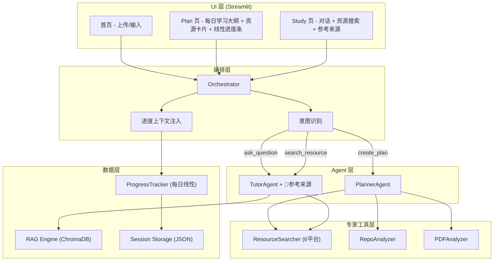
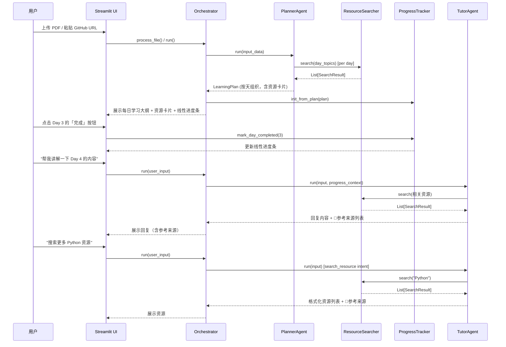

# 设计文档：资源聚合 + 动态学习路径

## 概述

本功能将 XLearning-Agent 的核心体验从「Quiz/Report 展示流」转向「资源聚合 + 动态学习路径」。主要变更包括：

1. 新增 `ResourceSearcher` 专家模块，封装 Bilibili、YouTube、Google、GitHub、小红书、微信公众号 六平台搜索能力
2. 新增 `ProgressTracker` 每日线性进度追踪机制，以 DayProgress 为最小单位，用户点击「完成」标记当天完成
3. 改造 `PlannerAgent`，生成以 Day 为单位的学习计划，自动调用 ResourceSearcher 为每天搜索真实资源
4. 改造 `TutorAgent`，支持资源推荐、基于进度上下文的动态辅导，每次回复末尾附带「📎 参考来源」列表
5. 改造 `Orchestrator`，新增 `search_resource` 意图，移除 `start_quiz` 意图，调整路由优先级
6. UI 从三步骤（Plan | Study | Quiz）简化为两步骤（Plan | Study），完全移除 Quiz，以资源卡片和每日进度条为核心
7. 新增 `SearchResult` 数据模型，支持 JSON 序列化/反序列化的 round-trip 正确性

## 架构

### 整体架构图



### 数据流




## 组件与接口

### 1. ResourceSearcher (`src/specialists/resource_searcher.py`)

新增的资源搜索专家模块，遵循现有 Specialist 模式（参考 `RepoAnalyzer`）。

```python
class SearchResult(BaseModel):
    """搜索结果数据模型"""
    title: str                          # 资源标题
    url: str                            # 资源链接
    platform: str                       # 来源平台: bilibili, youtube, google, github, xiaohongshu, wechat
    type: str                           # 资源类型: video, article, repo, tutorial, note
    description: str = ""               # 简要描述

    def to_dict(self) -> dict: ...
    
    @classmethod
    def from_dict(cls, data: dict) -> "SearchResult": ...


class ResourceSearcher:
    """多源资源搜索专家（6平台）"""
    
    PLATFORMS = ["bilibili", "youtube", "google", "github", "xiaohongshu", "wechat"]
    TIMEOUT = 10  # 秒，满足需求 1.6 的 10 秒超时要求
    
    def search(self, query: str, platforms: List[str] = None) -> List[SearchResult]:
        """
        搜索学习资源
        
        Args:
            query: 搜索关键词
            platforms: 指定平台列表，默认搜索全部 6 个平台
            
        Returns:
            SearchResult 列表（跳过失败平台，需求 1.4）
        """
        ...
    
    def _search_bilibili(self, query: str) -> List[SearchResult]: ...
    def _search_youtube(self, query: str) -> List[SearchResult]: ...
    def _search_google(self, query: str) -> List[SearchResult]: ...
    def _search_github(self, query: str) -> List[SearchResult]: ...
    def _search_xiaohongshu(self, query: str) -> List[SearchResult]: ...
    def _search_wechat(self, query: str) -> List[SearchResult]: ...
```

设计决策：
- 6 个平台搜索方法独立，单个平台失败不影响其他平台（需求 1.4）
- 使用 `httpx` 做 HTTP 请求，与 `RepoAnalyzer` 保持一致
- 总超时 10 秒，每个平台分配约 1.6 秒（需求 1.6）
- 小红书通过其 Web API 搜索笔记内容，返回 type 为 `note`
- 微信公众号通过搜狗微信搜索接口获取公众号文章，返回 type 为 `article`
- `SearchResult` 使用 Pydantic BaseModel，天然支持 JSON 序列化（需求 6.1）

### 2. ProgressTracker (`src/core/progress.py`)

每日线性进度追踪器，数据持久化到 session storage。完全基于 Day 为最小单位，无 Phase/Topic 层级。

```python
class DayProgress(BaseModel):
    """单天的学习进度"""
    day_number: int                     # 天数编号，从 1 开始
    title: str                          # 当天学习主题
    completed: bool = False             # 是否已完成

class ProgressTracker:
    """每日线性进度追踪器"""
    
    def __init__(self, session_id: str):
        self._session_id = session_id
        self._days: List[DayProgress] = []
    
    def init_from_plan(self, plan: LearningPlan) -> None:
        """从学习计划初始化每日进度列表"""
        self._days = [
            DayProgress(day_number=day.day_number, title=day.title)
            for day in plan.days
        ]
    
    def mark_day_completed(self, day_number: int) -> bool:
        """标记某天为已完成，返回是否成功"""
        for day in self._days:
            if day.day_number == day_number:
                day.completed = True
                self.save()
                return True
        return False
    
    def get_progress_summary(self) -> dict:
        """
        返回进度摘要
        Returns: {
            "total_days": int,
            "completed_days": int,
            "percentage": float,       # 0.0 ~ 1.0
            "current_day": Optional[int],  # 下一个未完成的天数编号
            "days": List[DayProgress]
        }
        """
        completed = sum(1 for d in self._days if d.completed)
        total = len(self._days)
        current = next((d.day_number for d in self._days if not d.completed), None)
        return {
            "total_days": total,
            "completed_days": completed,
            "percentage": completed / total if total > 0 else 0.0,
            "current_day": current,
            "days": self._days,
        }
    
    def save(self) -> None:
        """持久化到 session storage（需求 3.5）"""
        ...
    
    def load(self) -> None:
        """从 session storage 加载"""
        ...
    
    def reset(self) -> None:
        """重置为空白状态（需求 3.6）"""
        self._days = []
        self.save()
```

设计决策：
- 完全移除 TopicProgress / PhaseProgress 层级概念，只有 DayProgress
- 进度条为线性：已完成天数 / 总天数，简单直观
- 用户点击「完成」按钮即标记当天完成，无需逐个知识点勾选
- 与现有 `state.py` 的 session 存储机制集成

### 3. PlannerAgent 改造 (`src/agents/planner.py`)

生成以 Day 为单位的学习计划，每天搜索资源：

```python
# 在 run() 方法中：
# 1. 分析输入材料
# 2. 生成以 Day 为单位的学习计划
# 3. 为每天搜索资源
resource_searcher = ResourceSearcher()
for day in plan.days:
    results = resource_searcher.search(f"{plan.domain} {day.title}")
    day.resources.extend(results)
```

### 4. TutorAgent 改造 (`src/agents/tutor.py`)

新增资源搜索能力、进度上下文感知和参考来源生成：

```python
class TutorAgent(BaseAgent):
    def set_resource_searcher(self, searcher: ResourceSearcher): ...
    def set_progress_tracker(self, tracker: ProgressTracker): ...
    
    def _handle_free_mode(self, user_input, history, ...):
        # 在构建 prompt 时注入进度上下文（需求 4.5）
        progress_context = self._build_progress_context()
        # 如果检测到资源搜索请求，调用 ResourceSearcher（需求 1.3）
        ...
    
    def _build_reference_section(self, sources: List[dict]) -> str:
        """
        构建「📎 参考来源」区块（需求 5）
        
        Args:
            sources: 来源列表，每项包含 type（pdf/search/rag/ai）和详情
            
        Returns:
            格式化的参考来源文本，例如：
            
            📎 参考来源
            - PDF: machine_learning.pdf, 第3章 "神经网络基础"
            - 搜索: Bilibili, YouTube (关键词: "Python 入门")
            - RAG: 检索片段来自 langchain_docs.pdf
        """
        if not sources:
            return "\n\n📎 参考来源\n- 基于 AI 通用知识"
        
        lines = ["\n\n📎 参考来源"]
        for src in sources:
            if src["type"] == "pdf":
                lines.append(f"- PDF: {src['filename']}, {src['section']}")
            elif src["type"] == "search":
                lines.append(f"- 搜索: {', '.join(src['platforms'])} (关键词: \"{src['query']}\")")
            elif src["type"] == "rag":
                lines.append(f"- RAG: 检索片段来自 {src['source']}")
        return "\n".join(lines)
```

### 5. Orchestrator 改造 (`src/agents/orchestrator.py`)

- 新增 `search_resource` 意图类型
- 完全移除 `start_quiz` 意图
- 调整意图路由优先级为：`create_plan > ask_question > search_resource`（需求 7.6）
- 在 `_detect_intent_by_keywords` 中添加资源搜索关键词
- 在调用 Agent 前注入 ProgressTracker 上下文（需求 4.4）

```python
# 新增关键词
if any(kw in input_lower for kw in ["搜索资源", "找资源", "推荐资源", "search resource"]):
    return "search_resource"

# 移除所有 quiz/测验 相关的意图路由
# 调整 LLM 意图分类的可选 intent
# "create_plan, ask_question, search_resource, get_report, chitchat"
```

### 6. UI 改造

#### 6.1 主流程变更

从 `Plan | Study | Quiz` 三步骤改为 `Plan | Study` 两步骤（需求 7.6）。完全移除 Quiz 相关的所有入口。

修改 `src/ui/layout.py` 中的 `_render_clickable_stepper` 和 `render_workspace_view`，移除 Quiz 步骤。

#### 6.2 Plan 页面 - 每日学习大纲 + 资源卡片

在 `src/ui/renderer.py` 的 `render_plan_panel()` 中：
- 页面顶部显示线性进度条（已完成天数 / 总天数）（需求 7.3）
- 以天为单位列出每日学习大纲（Day 1, Day 2...）（需求 7.1）
- 每天显示「完成」按钮，点击标记该天完成（需求 7.2）
- 点击某天展开资源卡片列表（需求 7.4）

#### 6.3 资源卡片设计

每张资源卡片包含：
- 资源标题（可点击链接）
- 来源平台标识（Bilibili / YouTube / GitHub / Google / 小红书 / 微信公众号）
- 简要描述
- 资源类型标签（video / article / repo / tutorial / note）

```python
def render_resource_card(resource: SearchResult):
    """渲染单张资源卡片"""
    platform_icons = {
        "bilibili": "🅱️", "youtube": "▶️", "google": "🔍",
        "github": "🐙", "xiaohongshu": "📕", "wechat": "💬"
    }
    icon = platform_icons.get(resource.platform, "🔗")
    st.markdown(f"""
    <div class="resource-card">
        <span class="platform-badge">{icon} {resource.platform}</span>
        <a href="{resource.url}" target="_blank">{resource.title}</a>
        <p>{resource.description}</p>
        <span class="type-tag">{resource.type}</span>
    </div>
    """, unsafe_allow_html=True)
```

#### 6.4 Study 页面增强

在 `src/ui/renderer.py` 的 `render_study_panel()` 中：
- 添加「搜索更多资源」交互入口（需求 7.5）
- Tutor 回复末尾显示「📎 参考来源」区块
- 完全移除任何 Quiz/测验/自测相关入口


## 数据模型

### 新增模型

#### SearchResult (`src/core/models.py`)

```python
class SearchResult(BaseModel):
    """资源搜索结果"""
    title: str                          # 资源标题
    url: str                            # 资源链接
    platform: str                       # 来源平台: bilibili, youtube, google, github, xiaohongshu, wechat
    type: str                           # 资源类型: video, article, repo, tutorial, note
    description: str = ""               # 简要描述

    def to_dict(self) -> dict:
        return self.model_dump()
    
    @classmethod
    def from_dict(cls, data: dict) -> "SearchResult":
        return cls.model_validate(data)
```

#### DayProgress (`src/core/progress.py`)

```python
class DayProgress(BaseModel):
    """单天的学习进度"""
    day_number: int                     # 天数编号，从 1 开始
    title: str                          # 当天学习主题
    completed: bool = False             # 是否已完成
```

### 修改的模型

#### LearningDay（替代原 LearningPhase）

```python
class LearningDay(BaseModel):
    """单天的学习内容"""
    day_number: int                     # 天数编号
    title: str                          # 当天学习主题
    topics: List[str] = []              # 当天涉及的知识点
    resources: List[Union[str, SearchResult]] = []  # 学习资源（兼容旧格式）
```

#### LearningPlan（按天组织）

```python
class LearningPlan(BaseModel):
    """学习计划（按天组织）"""
    domain: str                         # 学习领域
    total_days: int                     # 总天数
    days: List[LearningDay] = []        # 每日学习内容
```

#### SessionState（新增 progress 字段）

```python
class SessionState(BaseModel):
    # ... 现有字段 ...
    progress: Optional[dict] = None     # ProgressTracker 序列化数据
```

### 数据持久化

进度数据存储在现有的 session JSON 文件中（`data/sessions/{session_id}.json`），新增 `progress` 键：

```json
{
  "domain": "LangChain",
  "messages": [...],
  "progress": {
    "days": [
      {"day_number": 1, "title": "LLM 基础与 Prompt Engineering", "completed": true},
      {"day_number": 2, "title": "LangChain 核心概念", "completed": true},
      {"day_number": 3, "title": "Chain 与 Agent 实战", "completed": false},
      {"day_number": 4, "title": "RAG 检索增强生成", "completed": false},
      {"day_number": 5, "title": "部署与优化", "completed": false}
    ]
  }
}
```


## 正确性属性 (Correctness Properties)

### Property 1: SearchResult 序列化 round-trip

*For any* 有效的 SearchResult 对象（platform 为 6 个平台之一），将其序列化为 JSON 字典后再反序列化，应产生与原始对象等价的 SearchResult。

**Validates: Requirements 6.1, 6.2**

### Property 2: ResourceSearcher 平台故障容错

*For any* 搜索查询和任意平台故障子集（1-5 个平台失败），ResourceSearcher 应仍然返回来自未故障平台的搜索结果列表（可能为空列表），且不抛出异常。

**Validates: Requirements 1.4**

### Property 3: 学习计划资源多平台覆盖

*For any* 由 Planner 生成的 LearningPlan（ResourceSearcher 返回正常结果时），每个 LearningDay 的主题应至少关联 2 个来自不同平台的 SearchResult。

**Validates: Requirements 2.2, 1.2**

### Property 4: ProgressTracker 每日完成状态一致性

*For any* 初始化后的 ProgressTracker 和任意序列的 `mark_day_completed` 操作，tracker 的状态应准确反映所有已标记完成的天数，且未标记的天保持未完成状态。

**Validates: Requirements 3.1, 3.2**

### Property 5: 进度摘要计算正确性（线性进度条）

*For any* ProgressTracker 状态，`get_progress_summary()` 返回的 `completed_days` 应等于所有 `completed=True` 的 DayProgress 数量，`percentage` 应等于 `completed_days / total_days`，`current_day` 应为第一个未完成天的 day_number。

**Validates: Requirements 3.3, 3.4**

### Property 6: ProgressTracker 持久化 round-trip

*For any* ProgressTracker 状态，执行 `save()` 后再 `load()`，应产生与保存前等价的进度状态。

**Validates: Requirements 3.5**

### Property 7: LearningDay resources 向后兼容

*For any* LearningDay 对象，其 `resources` 字段应同时接受纯字符串列表（旧格式）和 SearchResult 对象列表（新格式）以及两者的混合列表，且序列化/反序列化后数据不丢失。

**Validates: Requirements 6.3**

### Property 8: SearchResult 无效 JSON 错误处理

*For any* 无效的 JSON 输入（非字典、缺少必填字段、类型错误等），`SearchResult.from_dict()` 应抛出包含描述性信息的 `ValidationError`，而非未处理的 `KeyError`、`TypeError` 等底层异常。

**Validates: Requirements 6.4**

### Property 9: Orchestrator 意图路由优先级（无 Quiz）

*For any* 用户输入，当输入同时匹配多个意图关键词时，Orchestrator 的意图识别应按照 `create_plan > ask_question > search_resource` 的优先级返回最高优先级的意图。不存在 `start_quiz` 意图。

**Validates: Requirements 7.6**

### Property 10: Tutor 回复参考来源完整性

*For any* Tutor 回复，回复文本末尾应包含「📎 参考来源」区块。当引用了外部来源时，区块应列出具体来源；当未引用外部来源时，区块应标注「基于 AI 通用知识」。

**Validates: Requirements 5.1, 5.5**

## 错误处理

### ResourceSearcher 错误处理

| 错误场景 | 处理策略 | 对应需求 |
|---------|---------|---------|
| 单个平台 API 超时/失败 | 跳过该平台，返回其余平台结果，日志记录失败原因 | 1.4 |
| 所有平台均失败 | 返回空列表，不抛异常 | 1.4 |
| 搜索关键词为空 | 返回空列表 | - |
| 网络完全不可用 | 返回空列表，日志记录 | 1.4 |

### ProgressTracker 错误处理

| 错误场景 | 处理策略 | 对应需求 |
|---------|---------|---------|
| 标记不存在的 day_number | 返回 `False`，不修改状态 | 3.2 |
| Session 存储读取失败 | 初始化为空白状态，日志记录 | 3.6 |
| 进度数据格式损坏 | 重置为空白状态，日志记录 | 3.5 |

### SearchResult 反序列化错误处理

| 错误场景 | 处理策略 | 对应需求 |
|---------|---------|---------|
| JSON 数据缺少必填字段 | 抛出 Pydantic `ValidationError`，包含字段名和错误描述 | 6.4 |
| 字段类型不匹配 | 抛出 Pydantic `ValidationError`，包含期望类型和实际类型 | 6.4 |
| 输入非字典类型 | 抛出 `ValidationError`，描述期望输入格式 | 6.4 |

### Planner 资源搜索降级

| 错误场景 | 处理策略 | 对应需求 |
|---------|---------|---------|
| ResourceSearcher 对某天返回空结果 | 在该天的 resources 中标注"暂无推荐资源" | 2.5 |
| ResourceSearcher 整体不可用 | 生成不含资源的学习计划，不阻塞计划生成 | 2.5 |

### Tutor 参考来源降级

| 错误场景 | 处理策略 | 对应需求 |
|---------|---------|---------|
| 无法确定引用来源 | 标注「基于 AI 通用知识」 | 5.5 |
| 来源追踪模块异常 | 仍然输出回复，参考来源标注「来源追踪暂不可用」 | 5.1 |

## 测试策略

### 测试框架选择

- 单元测试：`pytest`（项目已使用）
- 属性测试：`hypothesis`（Python 生态最成熟的 property-based testing 库）
- 每个属性测试配置最少 100 次迭代

### 属性测试 (Property-Based Tests)

测试文件：`tests/test_resource_aggregation_properties.py`

| Property | 测试描述 | 生成器策略 |
|----------|---------|-----------|
| Property 1 | SearchResult round-trip | 生成随机 title/url/platform(6选1)/type/description |
| Property 2 | 平台故障容错 | 生成随机查询 + 随机故障平台子集（1-5个） |
| Property 3 | 多平台资源覆盖 | 生成随机 day topics + mock ResourceSearcher 返回多平台结果 |
| Property 4 | ProgressTracker 每日完成状态一致性 | 生成随机 LearningPlan(按天) + 随机 mark_day_completed 操作序列 |
| Property 5 | 线性进度摘要正确性 | 生成随机 ProgressTracker 状态 |
| Property 6 | ProgressTracker 持久化 round-trip | 生成随机每日进度状态，save/load 验证 |
| Property 7 | LearningDay 向后兼容 | 生成混合 str/SearchResult 的 resources 列表 |
| Property 8 | 无效 JSON 错误处理 | 生成随机无效输入（缺字段、错类型、非字典） |
| Property 9 | 意图路由优先级（无Quiz） | 生成包含多意图关键词的输入 |
| Property 10 | Tutor 参考来源完整性 | 生成随机来源列表，验证输出格式 |

每个测试必须包含注释标签：
```python
# Feature: resource-aggregation-dynamic-learning, Property N: ...
```

### 单元测试 (Unit Tests)

测试文件：`tests/test_resource_aggregation.py`

重点覆盖：
- SearchResult 构造和字段验证的具体示例（含 xiaohongshu/wechat 平台）
- DayProgress 模型构造和字段验证
- ProgressTracker 新会话初始化为空白状态（需求 3.6）
- ProgressTracker mark_day_completed 正确标记（需求 3.2）
- UI 主流程为两步骤的验证（需求 7.6）
- 无任何 Quiz 相关入口的验证（需求 7.7）
- 「搜索更多资源」入口存在性验证（需求 7.5）
- Planner 对空搜索结果的降级处理（需求 2.5）
- Tutor 回复包含「📎 参考来源」区块（需求 5.1）
- 资源卡片渲染正确性（需求 7.4）

### 测试配置

```python
# conftest.py 或 pytest.ini
# hypothesis settings
from hypothesis import settings
settings.register_profile("ci", max_examples=200)
settings.register_profile("dev", max_examples=100)
```
