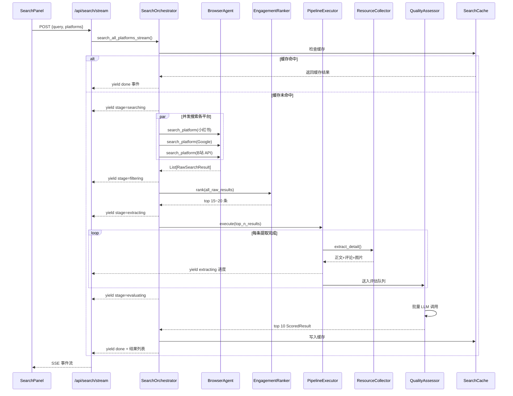
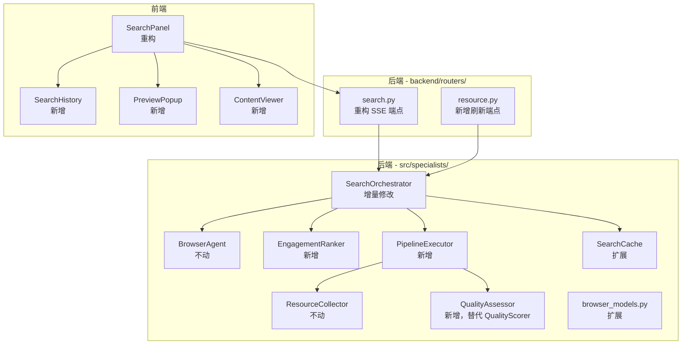

# 设计文档：搜索体验重设计

## 概述

本设计对现有搜索模块进行增量升级，核心改动集中在四个层面：

1. **两阶段漏斗筛选**：在现有 `SearchOrchestrator` 中新增 `EngagementRanker`（互动数据初筛）和 `QualityAssessor`（LLM 质量评估），替代当前的 `QualityScorer` 单阶段评分
2. **流水线并行调度**：新增 `PipelineExecutor`，实现详情提取与 LLM 评估的流水线并行，提取完一条立即送入评估队列
3. **SSE 阶段性进度推送**：重构 `/api/search/stream` 端点，推送 `searching → filtering → extracting → evaluating → done` 五阶段进度
4. **前端体验升级**：搜索历史记录卡片、外部资源预览浮窗（Preview_Popup）、本地文件内容查看器（Content_Viewer）

设计原则：
- 增量修改，不重写现有模块（`BrowserAgent`、`ResourceCollector` 核心逻辑不动）
- 扩展现有数据模型（`RawSearchResult`、`ScoredResult`），不替换
- 保持向后兼容，旧的 `/search` 同步端点继续可用

## 架构

### 整体数据流



### 模块关系



## 组件与接口

### 1. EngagementRanker（新增模块）

文件：`src/specialists/engagement_ranker.py`

职责：基于互动数据对搜索结果进行跨平台初筛排序。

```python
class EngagementRanker:
    """互动数据初筛排序器"""

    # 标题加权关键词
    BOOST_KEYWORDS: List[str] = ["经验贴", "面经", "攻略", "踩坑", "总结", "实战"]

    def rank(self, results: List[RawSearchResult], top_n: int = 20) -> List[RawSearchResult]:
        """
        对全部搜索结果进行互动数据初筛排序。
        
        排序逻辑：
        1. 计算评论/点赞比例作为核心指标
        2. 标题包含 BOOST_KEYWORDS 的文章额外加权
        3. 广告关键词降权（复用现有 _AD_KEYWORDS）
        4. 返回 top_n 条（结果总数 < 20 时返回全部）
        
        Args:
            results: 所有平台汇总的原始搜索结果
            top_n: 初筛保留数量，默认 20
        Returns:
            排序后的 top_n 条结果
        """
        ...

    def _engagement_score(self, result: RawSearchResult) -> float:
        """
        计算单条结果的互动分。
        
        公式：comment_like_ratio * (1 + title_boost) * ad_penalty
        - comment_like_ratio = comments / max(likes, 1)
        - title_boost = 0.3 if 标题包含加权关键词
        - ad_penalty = 0.3 if 标题包含广告关键词
        """
        ...
```

设计决策：
- 将互动排序逻辑从 `SearchOrchestrator` 中的 `_xhs_composite_score` 泛化为跨平台通用排序器
- 评论/点赞比例作为核心指标，因为高评论比例通常意味着内容引发了讨论，质量更高
- 保留现有广告关键词降权逻辑

### 2. QualityAssessor（新增模块，替代 QualityScorer）

文件：`src/specialists/quality_assessor.py`

职责：使用 LLM 对提取的正文和评论进行内容质量评估，单次调用同时生成评分、推荐理由、内容摘要、评论结论。

```python
@dataclass
class AssessmentResult:
    """LLM 质量评估结果"""
    quality_score: float          # 1-10 分
    recommendation_reason: str    # ≤50 字推荐理由
    content_summary: str          # ≤150 字内容摘要
    comment_summary: str          # ≤100 字评论结论摘要

class QualityAssessor:
    """LLM 质量评估器"""

    def __init__(self, llm_provider=None):
        self._llm = llm_provider

    async def assess_batch(
        self,
        items: List[Tuple[RawSearchResult, str, List[Dict]]],
    ) -> List[ScoredResult]:
        """
        批量评估：将多条结果打包为一个 prompt 进行单次 LLM 调用。
        
        Args:
            items: [(raw_result, extracted_content, top_comments), ...]
        Returns:
            评估后的 ScoredResult 列表（含摘要、评论结论等扩展字段）
        """
        ...

    async def assess_single_fallback(
        self, raw: RawSearchResult
    ) -> ScoredResult:
        """
        降级评估：正文提取失败时，基于标题、描述和互动数据评估。
        推荐理由中标注"正文未提取"。
        """
        ...

    def _build_batch_prompt(
        self,
        items: List[Tuple[RawSearchResult, str, List[Dict]]],
    ) -> str:
        """
        构建批量评估 prompt。
        
        对于正文 < 50 字的条目，直接使用原文作为摘要，
        prompt 中仅要求生成评分、推荐理由和评论结论。
        """
        ...

    def _heuristic_fallback(self, raw: RawSearchResult) -> AssessmentResult:
        """
        LLM 调用失败时的启发式降级：
        - 内容摘要 = 正文前 150 字
        - 评论结论 = 空
        - 质量评分 = 基于互动数据估算
        """
        ...
```

设计决策：
- 新建 `QualityAssessor` 而非修改 `QualityScorer`，因为接口完全不同（需要正文+评论输入，输出包含摘要和评论结论）
- `QualityScorer` 保留不删除，作为降级路径（需求 5.9）
- 批量打包为单次 LLM 调用，减少 API 调用次数和延迟

### 3. PipelineExecutor（新增模块）

文件：`src/specialists/pipeline_executor.py`

职责：协调详情提取与 LLM 评估的流水线并行调度。

```python
class PipelineExecutor:
    """流水线执行器：详情提取 → LLM 评估的并行调度"""

    MAX_CONCURRENT_TABS = 5       # 最大并发浏览器 tab
    SINGLE_EXTRACT_TIMEOUT = 30   # 单条提取超时（秒）
    BATCH_WAIT_TIMEOUT = 3.0      # 批次凑批超时（秒）
    BATCH_MAX_SIZE = 15           # 批次上限

    def __init__(
        self,
        browser_agent: BrowserAgent,
        resource_collector: ResourceCollector,
        quality_assessor: QualityAssessor,
    ):
        ...

    async def execute(
        self,
        candidates: List[RawSearchResult],
        progress_callback: Optional[Callable[[int, int], Awaitable[None]]] = None,
    ) -> List[ScoredResult]:
        """
        执行流水线：并行提取详情 → 实时送入评估队列 → 批量 LLM 评估。
        
        Args:
            candidates: 初筛后的候选结果
            progress_callback: 进度回调 (completed, total)
        Returns:
            评估完成的 ScoredResult 列表
        """
        ...

    async def _extract_worker(
        self,
        queue: asyncio.Queue,
        result: RawSearchResult,
        semaphore: asyncio.Semaphore,
    ) -> None:
        """
        单条提取 worker：
        1. 获取信号量（控制并发 tab 数）
        2. 提取正文 + 评论 + 图片
        3. 超时 30 秒自动跳过
        4. 提取完成后立即放入评估队列
        """
        ...

    async def _batch_assessor(
        self,
        queue: asyncio.Queue,
        results: List[ScoredResult],
    ) -> None:
        """
        批量评估消费者：
        1. 从队列中取出已提取的结果
        2. 凑批（上限 15 条，超时 3 秒）
        3. 调用 QualityAssessor.assess_batch()
        """
        ...
```

设计决策：
- 使用 `asyncio.Queue` 连接提取和评估两个阶段，实现真正的流水线并行
- 信号量控制并发 tab 数为 5，避免浏览器资源耗尽
- 3 秒凑批超时平衡了延迟和 LLM 调用效率

#### 取消机制

`PipelineExecutor` 接受一个 `asyncio.Event` 作为取消信号，用于在用户取消搜索时中断所有正在进行的提取和评估任务：

```python
def __init__(self, ..., cancel_event: Optional[asyncio.Event] = None):
    self._cancel = cancel_event or asyncio.Event()

async def _extract_worker(self, ...):
    if self._cancel.is_set():
        return  # 检查取消信号，立即退出
    async with sem:
        if self._cancel.is_set():
            return
        # ... 执行提取
```

`SearchOrchestrator.search_all_platforms_stream()` 在每次 yield 前检查取消信号。前端 AbortController 触发后端 SSE 连接断开，后端检测到连接关闭后设置 `cancel_event`，所有 worker 收到信号后退出，最后调用 `BrowserAgent.close()` 释放资源。

### 4. SearchOrchestrator（增量修改）

在现有 `SearchOrchestrator` 中新增 `search_all_platforms_stream()` 异步生成器方法：

```python
# 新增方法（不修改现有 search_all_platforms）
async def search_all_platforms_stream(
    self,
    query: str,
    platforms: List[str],
    top_k: int = 10,
    per_platform_limit: Optional[int] = None,
) -> AsyncGenerator[dict, None]:
    """
    流式搜索：通过 yield 推送各阶段进度事件。
    
    事件格式：
    - {"stage": "searching", "message": "正在搜索小红书...", "platform": "xiaohongshu"}
    - {"stage": "filtering", "message": "已获取 N 条，正在初筛...", "total": N}
    - {"stage": "extracting", "message": "正在提取详情（3/15）...", "completed": 3, "total": 15}
    - {"stage": "evaluating", "message": "AI 正在评估内容质量..."}
    - {"stage": "done", "results": [...]}
    - {"stage": "error", "message": "..."}
    
    流程：
    1. 检查缓存 → 命中直接 yield done
    2. 并发搜索各平台 → yield searching 进度
    3. EngagementRanker 初筛 → yield filtering
    4. PipelineExecutor 提取+评估 → yield extracting/evaluating
    5. 排序取 top_k → 写入缓存 → yield done
    """
    ...
```

修改点：
- 新增 `search_all_platforms_stream()` 方法
- 构造函数中新增 `EngagementRanker`、`QualityAssessor` 和 `PipelineExecutor` 实例
- 构造函数同时将 `llm_provider` 传给 `QualityAssessor`（新）和 `QualityScorer`（保留作为降级路径）
- 单平台超时从 60s 调整为 45s（需求 1.5）
- 现有 `search_all_platforms()` 保持不变，作为同步端点的后端

#### 浏览器生命周期管理

当前 `search_all_platforms()` 在搜索完成后立即调用 `await self.close()` 关闭浏览器。新的 `search_all_platforms_stream()` 需要在搜索阶段结束后保持浏览器打开，因为 `PipelineExecutor` 还需要用浏览器 tab 提取详情。浏览器关闭时机调整为：

```
搜索阶段（浏览器打开）→ 详情提取阶段（浏览器保持打开）→ LLM 评估阶段（浏览器关闭）→ done
```

具体实现：在 `PipelineExecutor.execute()` 的所有提取 worker 完成后（无论成功或超时），由 `SearchOrchestrator` 调用 `await self.close()` 关闭浏览器，然后再进入 LLM 评估阶段。这样确保浏览器不会在后台空转。

#### 多平台浏览器上下文限制

当前 `BrowserAgent` 只维护一个 `_context`，搜索小红书时会加载小红书的 cookie。如果同时搜索 Google 等不需要登录的平台，共用同一个上下文不会有问题（B 站走独立 API，Google 不需要 cookie）。但如果未来新增需要登录的平台（如微信），需要为每个需要登录的平台创建独立的 browser context。当前阶段不做改动，记录为已知限制。

### 5. 后端 API 端点

#### 5.1 重构 `/api/search/stream`（search.py）

SSE 事件格式升级：

```python
# 新的 SSE 事件格式
class SearchProgressEvent(BaseModel):
    stage: Literal["searching", "filtering", "extracting", "evaluating", "done", "error"]
    message: str = ""
    platform: Optional[str] = None
    total: Optional[int] = None
    completed: Optional[int] = None
    results: Optional[List[SearchResultItem]] = None

# SearchResultItem 扩展
class SearchResultItem(BaseModel):
    id: str
    title: str
    url: str
    platform: str
    description: str              # 原有
    qualityScore: float           # 原有
    recommendationReason: str     # 原有
    contentSummary: str = ""      # 新增：AI 内容摘要
    commentSummary: str = ""      # 新增：评论结论摘要
    engagementMetrics: Dict[str, Any] = {}  # 新增：互动指标
    imageUrls: List[str] = []     # 新增：图片 URL
```

#### 5.2 新增 `/api/resource/refresh`（resource.py）

```python
# 新增路由文件：backend/routers/resource.py
class RefreshRequest(BaseModel):
    url: str
    platform: str

class RefreshResponse(BaseModel):
    content: str                  # 正文内容
    contentSummary: str           # AI 内容摘要
    comments: List[Dict]          # 评论列表
    commentSummary: str           # 评论结论摘要
    imageUrls: List[str]          # 图片 URL
    engagementMetrics: Dict       # 互动指标
    qualityScore: float           # 质量评分
    recommendationReason: str     # 推荐理由

@router.post("/resource/refresh", response_model=RefreshResponse)
async def refresh_resource(body: RefreshRequest):
    """
    刷新单条资源详情。
    超时 90 秒返回 408，URL 不可访问返回 422。
    """
    ...
```

### 6. 前端组件

#### 6.1 SearchPanel 重构

修改 `frontend/src/components/source-panel/SearchPanel.tsx`：

- 状态管理新增 `searchStage`（当前搜索阶段）和 `searchHistory`（搜索历史列表）
- SSE 事件处理适配新的 `stage` 字段格式
- 搜索完成后自动将结果保存为历史记录
- 新搜索时取消当前进行中的搜索（AbortController）

```typescript
// 新增类型
interface SearchStage {
  stage: 'searching' | 'filtering' | 'extracting' | 'evaluating' | 'done'
  message: string
  completed?: number
  total?: number
}

interface SearchHistoryEntry {
  id: string
  query: string
  platforms: PlatformType[]
  results: SearchResult[]
  resultCount: number
  searchedAt: string  // ISO 8601
}
```

#### 6.2 SearchHistoryCard（新增组件）

文件：`frontend/src/components/source-panel/SearchHistoryCard.tsx`

```typescript
interface SearchHistoryCardProps {
  entry: SearchHistoryEntry
  isExpanded: boolean
  onToggle: () => void
}
```

折叠态显示：搜索关键词 + 搜索模式标签（平台图标列表）+ 结果数量
展开态显示：完整 top 10 结果列表 + 搜索时间 + 收起按钮

#### 6.3 PreviewPopup（新增组件）

文件：`frontend/src/components/source-panel/PreviewPopup.tsx`

```typescript
interface PreviewPopupProps {
  result: SearchResult  // 扩展后的 SearchResult，含摘要等字段
  onClose: () => void
  onRefresh: () => void
}
```

内容区域：标题、URL、平台标识、AI 摘要、评论结论、图片缩略图网格、互动指标、评分、推荐理由
操作按钮：查看完整信息（新标签页打开）、刷新、关闭
键盘支持：Escape 关闭
刷新状态：加载骨架屏 / 错误提示+重试

#### 材料与搜索结果的数据关联

用户从搜索结果"加入学习材料"后，当前 `Material` 类型只存了基础字段（id, type, name, url, status）。但预览浮窗需要 `contentSummary`、`commentSummary`、`imageUrls`、`engagementMetrics` 等完整数据。

解决方案：在前端 `searchStore` 中维护一个 `resultDetailMap: Record<string, SearchResult>`，以材料 id 为键存储完整的搜索结果数据。当用户点击外部资源材料时，先从 `resultDetailMap` 中查找对应的完整数据传给 `PreviewPopup`。

```typescript
// searchStore 扩展
interface SearchStore {
  history: SearchHistoryEntry[]
  resultDetailMap: Record<string, SearchResult>  // materialId → 完整搜索结果
  addEntry: (entry: SearchHistoryEntry) => void
  saveResultDetails: (results: SearchResult[]) => void  // 加入材料时调用
  getResultDetail: (materialId: string) => SearchResult | undefined
}
```

这样 `Material` 类型不需要扩展，保持轻量；完整数据通过 `searchStore` 的 persist 中间件持久化到 localStorage，刷新页面后仍可用。

#### 6.4 ContentViewer（新增组件）

文件：`frontend/src/components/source-panel/ContentViewer.tsx`

```typescript
interface ContentViewerProps {
  materialId: string
  fileType: 'markdown' | 'pdf' | 'text'
  onBack: () => void
}
```

功能：
- Markdown 渲染（使用 `react-markdown`）
- PDF 文本内容展示
- 返回材料列表导航
- 加载指示器 / 错误提示+重试

### 7. 前端类型扩展

扩展 `frontend/src/types/index.ts`：

```typescript
// 扩展 SearchResult
export interface SearchResult {
  id: string
  title: string
  url: string
  platform: PlatformType
  description: string
  qualityScore: number
  recommendationReason: string
  // 新增字段
  contentSummary?: string       // AI 内容摘要
  commentSummary?: string       // 评论结论摘要
  engagementMetrics?: Record<string, any>  // 互动指标
  imageUrls?: string[]          // 图片 URL 列表
}

// 新增搜索历史类型
export interface SearchHistoryEntry {
  id: string
  query: string
  platforms: PlatformType[]
  results: SearchResult[]
  resultCount: number
  searchedAt: string
}

// 新增搜索阶段类型
export type SearchStage = 'idle' | 'searching' | 'filtering' | 'extracting' | 'evaluating' | 'done' | 'error'
```

## 数据模型

### 后端模型扩展

#### browser_models.py 扩展

在现有 `ScoredResult` 中新增字段：

```python
class ScoredResult(BaseModel):
    """带评分的搜索结果（扩展版）"""
    raw: RawSearchResult
    quality_score: float = 0.0
    recommendation_reason: str = ""
    # 新增字段
    content_summary: str = ""         # AI 内容摘要（≤150 字）
    comment_summary: str = ""         # 评论结论摘要（≤100 字）
    extracted_content: str = ""       # 提取的正文内容（用于缓存）
```

`RawSearchResult` 不需要修改，现有字段已满足需求（`image_urls`、`top_comments`、`engagement_metrics` 等已存在）。

#### core/models.py 扩展

在现有 `SearchResult` 中新增字段：

```python
class SearchResult(BaseModel):
    """资源搜索结果（扩展版）"""
    # 现有字段保持不变
    title: str
    url: str
    platform: str
    type: str
    description: str = ""
    quality_score: float = 0.0
    recommendation_reason: str = ""
    engagement_metrics: Dict[str, Any] = Field(default_factory=dict)
    comments_preview: List[str] = Field(default_factory=list)
    # 新增字段
    content_summary: str = ""         # AI 内容摘要
    comment_summary: str = ""         # 评论结论摘要
    image_urls: List[str] = Field(default_factory=list)  # 图片 URL 列表
```

### SSE 事件数据模型

```python
class SSEProgressEvent(BaseModel):
    """SSE 进度事件"""
    stage: Literal["searching", "filtering", "extracting", "evaluating", "done", "error"]
    message: str = ""
    platform: Optional[str] = None       # searching 阶段使用
    total: Optional[int] = None          # filtering/extracting 阶段使用
    completed: Optional[int] = None      # extracting 阶段使用
    results: Optional[List[dict]] = None # done 阶段使用
    error: Optional[str] = None          # error 阶段使用
```

### 搜索历史存储

搜索历史使用 zustand store + `persist` 中间件持久化到 localStorage（与现有 `sourceStore`、`chatStore` 保持一致）。原因：
- 用户刷新页面后搜索历史不应丢失（之前 sourceStore 和 chatStore 已经用 persist 解决了同样的问题）
- 后端使用内存存储，不适合存搜索历史
- localStorage 足够存储搜索历史（每条记录约 5-10KB，保留最近 20 条即可）

新增文件：`frontend/src/store/searchStore.ts`

```typescript
interface SearchStore {
  history: SearchHistoryEntry[]
  addEntry: (entry: SearchHistoryEntry) => void
  clearHistory: () => void
}

export const useSearchStore = create<SearchStore>()(
  persist(
    (set) => ({
      history: [],
      addEntry: (entry) => set((s) => ({
        history: [entry, ...s.history].slice(0, 20)  // 最多保留 20 条
      })),
      clearHistory: () => set({ history: [] }),
    }),
    { name: 'search-history' }
  )
)
```

### 缓存策略

扩展现有 `SearchCache`，缓存的 `SearchResult` 现在包含摘要和评论结论等完整数据。缓存键和 TTL 机制不变。

刷新 API 成功后，需要更新缓存中对应资源的详情数据。在 `SearchCache` 中新增方法：

```python
def update_result(self, url: str, updated: SearchResult) -> None:
    """更新缓存中某条结果的详情数据"""
    ...
```

## 正确性属性

*属性（Property）是指在系统所有合法执行路径中都应成立的特征或行为——本质上是对系统应做什么的形式化陈述。属性是连接人类可读规格说明与机器可验证正确性保证之间的桥梁。*

### Property 1: 缓存往返一致性

*For any* 搜索查询 query 和平台列表 platforms，执行搜索后将结果写入缓存，再以相同的 query + platforms 查询缓存，应返回与原始搜索结果完全相同的列表（包含摘要、评论结论等完整数据）。

**Validates: Requirements 1.6, 1.7, 5.10**

### Property 2: SSE 事件结构正确性

*For any* SSE 进度事件，当 `stage` 为 `searching` 时应包含非空 `platform` 字段；当 `stage` 为 `filtering` 时应包含非负整数 `total` 字段；当 `stage` 为 `extracting` 时应包含 `completed` 和 `total` 字段且 `completed <= total`；当 `stage` 为 `done` 时应包含 `results` 列表。所有事件的 `stage` 字段取值必须为 `searching`、`filtering`、`extracting`、`evaluating`、`done`、`error` 之一。

**Validates: Requirements 2.1, 2.2, 2.3, 2.4, 2.5**

### Property 3: Done 事件结果完整性

*For any* SSE `done` 事件中的每条结果，应包含以下全部字段且非空：id、title、url、platform、contentSummary、commentSummary、engagementMetrics、qualityScore、recommendationReason。结果列表长度不超过 10。

**Validates: Requirements 2.7, 2.8**

### Property 4: 搜索阶段文案映射

*For any* 有效的 `stage` 枚举值，SearchPanel 应渲染对应的中文状态文案（如 `searching` → "正在搜索..."、`filtering` → "正在初筛..."、`extracting` → "正在提取详情..."、`evaluating` → "AI 正在评估..."）。

**Validates: Requirements 2.9**

### Property 5: 搜索历史单调递增

*For any* 搜索完成事件序列，每次搜索完成后搜索历史列表长度应增加 1，新条目出现在列表顶部，且之前的历史条目不被删除或修改。

**Validates: Requirements 3.3, 3.7**

### Property 6: 搜索历史时间倒序

*For any* 搜索历史列表，列表中的条目应按 `searchedAt` 时间戳严格降序排列。

**Validates: Requirements 3.8**

### Property 7: 历史卡片折叠态信息完整

*For any* 搜索历史条目，其折叠态渲染应包含搜索关键词文本、搜索平台标识（图标列表）和结果数量。

**Validates: Requirements 3.4**

### Property 8: 结果列表统一排序

*For any* 搜索完成后的结果列表，结果应按 `qualityScore` 降序排列，不按平台分组，且每条结果显示来源平台标识。

**Validates: Requirements 3.1, 3.2**

### Property 9: 互动排序核心指标

*For any* 两条搜索结果 A 和 B，若 A 的评论/点赞比例高于 B，且两者标题均不包含加权关键词和广告关键词，则 EngagementRanker 应将 A 排在 B 前面。

**Validates: Requirements 4.2**

### Property 10: 标题关键词加权

*For any* 搜索结果，若其标题包含加权关键词（经验贴、面经、攻略、踩坑、总结、实战），则其互动分应高于一条互动数据完全相同但标题不包含加权关键词的结果。

**Validates: Requirements 4.3**

### Property 11: 初筛输出数量约束

*For any* 输入结果集合，EngagementRanker 的输出数量应等于 `min(len(input), top_n)`，其中 `top_n` 在 15 到 20 之间。当输入少于 20 条时，输出应包含全部输入。

**Validates: Requirements 4.4, 4.5**

### Property 12: 质量评估四项输出完整

*For any* 正文内容 ≥ 50 字的搜索结果，QualityAssessor 的评估结果应同时包含非空的 quality_score（1-10）、recommendation_reason（≤50 字）、content_summary（≤150 字）和 comment_summary（≤100 字）。

**Validates: Requirements 5.4**

### Property 13: 短正文直接作为摘要

*For any* 正文内容少于 50 字的搜索结果，QualityAssessor 返回的 `content_summary` 应等于原始正文内容。

**Validates: Requirements 5.5**

### Property 14: LLM 失败降级摘要

*For any* LLM 调用失败的情况，QualityAssessor 返回的 `content_summary` 应等于正文前 150 字，`comment_summary` 应为空字符串，`quality_score` 应基于互动数据估算（> 0）。

**Validates: Requirements 5.6**

### Property 15: 最终输出不超过 10 条

*For any* 搜索执行，最终输出的结果列表长度不超过 10，且按 `quality_score` 降序排列。

**Validates: Requirements 5.7**

### Property 16: 并发提取上限为 5

*For any* 流水线执行过程，同时进行详情提取的任务数不超过 5。

**Validates: Requirements 6.1**

### Property 17: 批次大小上限为 15

*For any* QualityAssessor 的单次 LLM 调用，批次中的结果数量不超过 15 条。

**Validates: Requirements 6.4**

### Property 18: 小红书图片 URL 数量约束

*For any* 小红书搜索结果，其 `image_urls` 列表长度不超过 9。提取详情后的结果中 `image_urls` 字段应保持存在。

**Validates: Requirements 7.1, 7.2**

### Property 19: 预览浮窗内容区域完整

*For any* 包含全部字段的 SearchResult，PreviewPopup 渲染应包含以下全部内容区域：标题、URL、平台标识、AI 摘要、评论结论、互动指标、评分、推荐理由。当 `imageUrls` 非空时还应展示图片缩略图。

**Validates: Requirements 8.2**

### Property 20: Markdown 渲染正确性

*For any* 有效的 Markdown 内容字符串，ContentViewer 应将标题渲染为 heading 元素、列表渲染为 list 元素、代码块渲染为 code 元素。

**Validates: Requirements 9.2**

### Property 21: 刷新响应结构完整

*For any* 成功的 `/api/resource/refresh` 响应，应包含以下全部字段：content、contentSummary、comments、commentSummary、imageUrls、engagementMetrics、qualityScore、recommendationReason。

**Validates: Requirements 10.2, 10.3**

### Property 22: 刷新后缓存更新

*For any* 成功的资源刷新操作，刷新后查询缓存中该 URL 对应的结果，其详情数据应与刷新返回的数据一致。

**Validates: Requirements 10.7**

### Property 23: 并发搜索任务数等于平台数

*For any* 包含 N 个有效平台的搜索请求，SearchOrchestrator 应创建恰好 N 个并发搜索任务，最终汇总的结果应包含来自所有成功平台的数据。

**Validates: Requirements 1.1, 1.2**

## 错误处理

### 后端错误处理

| 场景 | 处理策略 | 对应需求 |
|------|----------|----------|
| 单平台搜索超时（45s） | 记录错误日志，使用其他平台结果继续漏斗筛选 | 1.3, 1.5 |
| 单平台搜索异常 | 捕获异常，记录错误，SSE 推送 `error` 事件（含平台名），继续处理其他平台 | 1.3, 2.10 |
| 所有平台搜索失败 | SSE 推送 `error` 事件，返回空结果 | 2.10 |
| 单条详情提取超时（30s） | 跳过该条，继续处理队列中下一条 | 6.6 |
| 单条正文提取失败 | 降级评估：基于标题+描述+互动数据评分，推荐理由标注"正文未提取" | 5.8 |
| LLM 质量评估调用失败 | 降级：使用正文前 150 字作为摘要，评论结论置空，评分基于互动数据估算 | 5.6 |
| LLM 质量评估整体失败 | 降级：使用第一阶段互动数据排序结果作为最终输出 | 5.9 |
| 资源刷新超时（90s） | 返回 HTTP 408 + 超时错误信息 | 10.5 |
| 资源 URL 不可访问 | 返回 HTTP 422 + 错误描述 | 10.6 |
| 资源刷新失败 | 返回 HTTP 500 + 错误信息，不更新缓存 | 10.7 |
| 用户取消搜索 | 关闭所有浏览器 tab 和实例，释放资源 | 1.8 |

### 前端错误处理

| 场景 | 处理策略 | 对应需求 |
|------|----------|----------|
| SSE 连接断开 | 显示"搜索失败，请检查网络或重试"错误提示 | — |
| 搜索超时（60s 前端超时） | AbortController 取消请求，显示"搜索超时，请重试" | 1.4 |
| 预览浮窗刷新失败 | 显示错误提示 + "重试"按钮 | 8.7 |
| 文件内容加载失败 | 显示错误提示 + "重试"按钮 | 9.6 |
| 预览浮窗刷新中 | 显示加载骨架屏 | 8.6 |
| 文件内容加载中 | 显示加载指示器 | 9.5 |

### 降级链路

```
正常路径: 并发搜索 → 互动初筛 → 详情提取 → LLM 评估 → top 10
                                      ↓ 提取失败
                              降级评估（标题+描述+互动数据）
                                              ↓ LLM 失败
                              启发式评分 + 正文前 150 字摘要
                                              ↓ LLM 整体失败
                              直接使用互动数据排序结果
```

## 测试策略

### 属性测试（Property-Based Testing）

使用 `hypothesis`（Python 后端）和 `fast-check`（TypeScript 前端）进行属性测试。

每个属性测试至少运行 100 次迭代，使用随机生成的输入验证属性是否成立。

每个属性测试必须以注释标注对应的设计文档属性：
```python
# Feature: search-experience-redesign, Property 1: 缓存往返一致性
```

#### 后端属性测试（Python + hypothesis）

| 属性 | 测试文件 | 生成器 |
|------|----------|--------|
| P1: 缓存往返一致性 | `tests/test_search_redesign_properties.py` | 随机 query + platforms + SearchResult 列表 |
| P2: SSE 事件结构正确性 | `tests/test_search_redesign_properties.py` | 随机 stage 枚举 + 对应字段 |
| P3: Done 事件结果完整性 | `tests/test_search_redesign_properties.py` | 随机 ScoredResult 列表 |
| P9: 互动排序核心指标 | `tests/test_search_redesign_properties.py` | 随机 RawSearchResult 对（不同 comment/like 比例） |
| P10: 标题关键词加权 | `tests/test_search_redesign_properties.py` | 随机 RawSearchResult + 随机加权关键词注入 |
| P11: 初筛输出数量约束 | `tests/test_search_redesign_properties.py` | 随机长度的 RawSearchResult 列表 |
| P12: 质量评估四项输出完整 | `tests/test_search_redesign_properties.py` | 随机正文（≥50 字）+ 评论列表 |
| P13: 短正文直接作为摘要 | `tests/test_search_redesign_properties.py` | 随机短正文（<50 字） |
| P14: LLM 失败降级摘要 | `tests/test_search_redesign_properties.py` | 随机正文 + 模拟 LLM 失败 |
| P15: 最终输出不超过 10 条 | `tests/test_search_redesign_properties.py` | 随机长度的 ScoredResult 列表 |
| P17: 批次大小上限为 15 | `tests/test_search_redesign_properties.py` | 随机长度的候选列表 |
| P18: 小红书图片 URL 数量约束 | `tests/test_search_redesign_properties.py` | 随机小红书 API 响应 JSON |
| P21: 刷新响应结构完整 | `tests/test_search_redesign_properties.py` | 随机 URL + platform |
| P22: 刷新后缓存更新 | `tests/test_search_redesign_properties.py` | 随机 URL + 刷新结果 |
| P23: 并发搜索任务数等于平台数 | `tests/test_search_redesign_properties.py` | 随机平台子集 |

#### 前端属性测试（TypeScript + fast-check）

| 属性 | 测试文件 | 生成器 |
|------|----------|--------|
| P4: 搜索阶段文案映射 | `frontend/src/test/search-redesign.property.test.tsx` | 随机 stage 枚举值 |
| P5: 搜索历史单调递增 | `frontend/src/test/search-redesign.property.test.tsx` | 随机搜索完成事件序列 |
| P6: 搜索历史时间倒序 | `frontend/src/test/search-redesign.property.test.tsx` | 随机 SearchHistoryEntry 列表 |
| P7: 历史卡片折叠态信息完整 | `frontend/src/test/search-redesign.property.test.tsx` | 随机 SearchHistoryEntry |
| P8: 结果列表统一排序 | `frontend/src/test/search-redesign.property.test.tsx` | 随机 SearchResult 列表（多平台） |
| P19: 预览浮窗内容区域完整 | `frontend/src/test/search-redesign.property.test.tsx` | 随机 SearchResult（全字段） |
| P20: Markdown 渲染正确性 | `frontend/src/test/search-redesign.property.test.tsx` | 随机 Markdown 字符串 |

### 单元测试

单元测试聚焦于具体示例、边界情况和错误条件，与属性测试互补。

#### 后端单元测试

- `EngagementRanker`：广告关键词降权、空结果处理、单平台结果排序
- `QualityAssessor`：prompt 构建格式、LLM 响应解析、降级评估逻辑
- `PipelineExecutor`：提取超时跳过、队列为空时的行为
- `SearchOrchestrator`：缓存命中路径、全平台失败路径、取消搜索资源释放
- `/api/resource/refresh`：408 超时响应、422 无效 URL 响应
- `/api/search/stream`：SSE 事件序列完整性

#### 前端单元测试

- `SearchPanel`：新搜索取消旧搜索、空查询不触发搜索
- `SearchHistoryCard`：展开/收起切换、搜索时间格式化
- `PreviewPopup`：Escape 键关闭、刷新按钮触发 API 调用、骨架屏显示
- `ContentViewer`：返回按钮导航、加载指示器显示、错误重试
