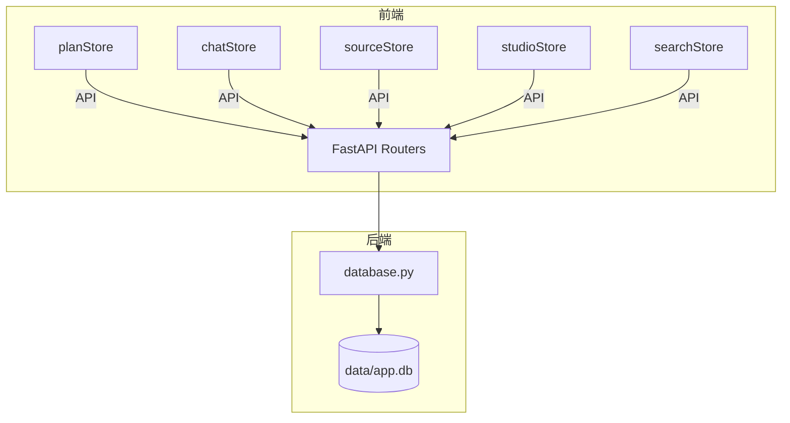
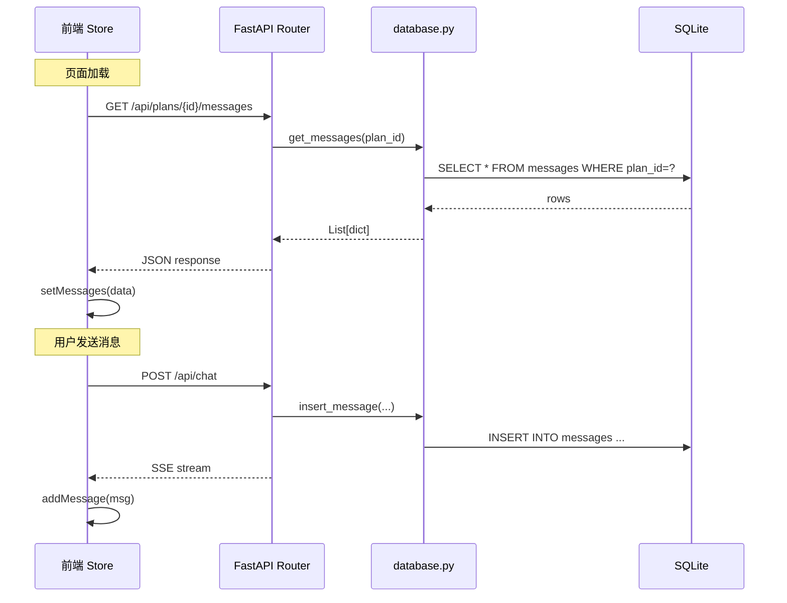
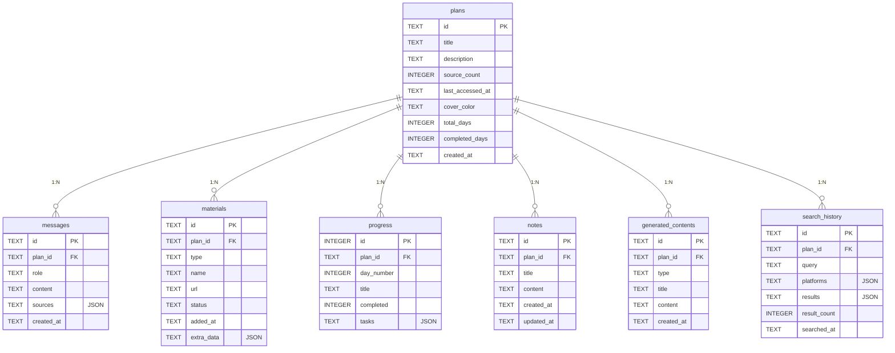

# 设计文档：SQLite 统一持久化

## 概述

本设计将学习规划平台的数据存储从"后端内存字典 + 前端 localStorage"迁移到统一的 SQLite 持久化方案。核心变更：

1. 新增 `backend/database.py` 模块，封装 SQLite 连接管理和所有 CRUD 操作
2. 后端路由（plans、notes、upload、chat、search、studio）从内存字典改为调用 database 模块
3. 前端 zustand store 去掉 `persist` 中间件，改为 API 调用 + 本地状态
4. 删除遗留文件（store.py、session.py、data/sessions/、data/index.json）

数据库文件位于 `data/app.db`，启用 WAL 模式和外键约束。这是单用户本地应用，不需要连接池。



## 架构

### 整体数据流

迁移前：
- 前端 zustand persist → localStorage（主数据源）
- 后端内存字典 `_store`、`_plans`、`_notes`（重启丢失）
- 前端页面加载时从 localStorage 恢复，兜底请求 `/api/session/{plan_id}`

迁移后：
- SQLite `data/app.db` 作为唯一数据源（Single Source of Truth）
- 前端 zustand store 仅作为 UI 状态缓存，不持久化
- 页面加载时通过 API 从后端获取数据



### 模块职责

| 模块 | 职责 |
|------|------|
| `backend/database.py` | SQLite 连接管理、建表、所有 CRUD 函数 |
| `backend/routers/plans.py` | 规划 CRUD，调用 database 模块 |
| `backend/routers/chat.py` | 聊天 SSE，消息写入 SQLite |
| `backend/routers/upload.py` | 文件上传，材料元数据写入 SQLite |
| `backend/routers/notes.py` | 笔记 CRUD，调用 database 模块 |
| `backend/routers/studio.py` | 内容生成，结果写入 SQLite |
| `backend/routers/search.py` | 搜索，历史写入 SQLite |
| `backend/routers/resource.py` | 资源刷新，刷新后更新 materials.extra_data |
| `frontend/src/store/*.ts` | 去掉 persist，改为 API 调用 + 本地状态 |

## 组件与接口

### 1. `backend/database.py` — 数据访问层

单模块封装所有 SQLite 操作。使用 Python 内置 `sqlite3` 模块，无需额外依赖。

```python
# 连接管理
def get_connection() -> sqlite3.Connection:
    """获取 SQLite 连接（单用户，复用同一连接）"""

def init_db() -> None:
    """初始化数据库：创建表、启用 WAL 和外键"""

# Plans CRUD
def create_plan(plan: dict) -> dict: ...
def get_all_plans() -> list[dict]: ...
def get_plan(plan_id: str) -> dict | None: ...
def update_plan(plan_id: str, updates: dict) -> dict | None: ...
def delete_plan(plan_id: str) -> bool: ...

# Messages CRUD
def insert_message(msg: dict) -> dict: ...
def get_messages(plan_id: str) -> list[dict]: ...

# Materials CRUD
def insert_material(mat: dict) -> dict: ...
def get_materials(plan_id: str) -> list[dict]: ...
def update_material_status(material_id: str, status: str) -> bool: ...
def update_material_extra_data(material_id: str, extra_data: dict) -> bool: ...
def delete_material(material_id: str) -> bool: ...

# Progress CRUD
def upsert_progress(plan_id: str, days: list[dict]) -> None: ...
def get_progress(plan_id: str) -> list[dict]: ...
def update_progress_completed(plan_id: str, day_number: int, completed: bool) -> bool: ...
def update_progress_tasks(plan_id: str, day_number: int, tasks: list[dict]) -> bool: ...

# Notes CRUD
def create_note(note: dict) -> dict: ...
def get_notes(plan_id: str) -> list[dict]: ...
def update_note(note_id: str, updates: dict) -> dict | None: ...
def delete_note(note_id: str) -> bool: ...

# Generated Contents CRUD
def insert_generated_content(content: dict) -> dict: ...
def get_generated_contents(plan_id: str) -> list[dict]: ...

# Search History CRUD
def insert_search_history(entry: dict) -> dict: ...
def get_search_history(plan_id: str, limit: int = 20) -> list[dict]: ...
def delete_search_history(plan_id: str) -> bool: ...
```

连接管理策略：
- 使用模块级 `_connection` 变量，懒初始化
- `init_db()` 在 FastAPI `startup` 事件中调用
- 所有写操作使用 `with conn:` 上下文管理器（自动 commit/rollback）
- JSON 字段（sources、tasks、platforms、results、extra_data）使用 `json.dumps` / `json.loads` 序列化

### 2. API 端点变更

#### 新增端点

| 方法 | 路径 | 说明 |
|------|------|------|
| GET | `/api/plans/{plan_id}/messages` | 获取规划的消息列表 |
| GET | `/api/plans/{plan_id}/materials` | 获取规划的材料列表 |
| POST | `/api/plans/{plan_id}/progress` | 批量写入进度数据 |
| GET | `/api/plans/{plan_id}/progress` | 获取规划的进度数据 |
| PUT | `/api/plans/{plan_id}/progress/{day_number}` | 更新某天完成状态 |
| PUT | `/api/plans/{plan_id}/progress/{day_number}/tasks` | 更新某天任务列表 |
| GET | `/api/plans/{plan_id}/notes` | 获取规划的笔记列表 |
| GET | `/api/plans/{plan_id}/generated-contents` | 获取规划的生成内容 |
| POST | `/api/plans/{plan_id}/generated-contents` | 保存生成内容 |
| GET | `/api/plans/{plan_id}/search-history` | 获取搜索历史 |
| POST | `/api/plans/{plan_id}/search-history` | 保存搜索历史 |
| DELETE | `/api/plans/{plan_id}/search-history` | 清除搜索历史 |

#### 修改的端点

| 端点 | 变更 |
|------|------|
| `POST /api/plans` | 从 `_plans` 字典改为 `database.create_plan()` |
| `GET /api/plans` | 从 `_plans.values()` 改为 `database.get_all_plans()` |
| `PUT /api/plans/{plan_id}` | 从 `_plans[id]` 改为 `database.update_plan()` |
| `DELETE /api/plans/{plan_id}` | 从 `del _plans[id]` 改为 `database.delete_plan()`（级联删除） |
| `POST /api/chat` | SSE 流中将用户消息和 AI 回复写入 `database.insert_message()` |
| `POST /api/upload` | 材料元数据写入 `database.insert_material()`，状态更新用 `database.update_material_status()` |
| `POST /api/upload/url` | 同上 |
| `DELETE /api/material/{id}` | 改为 `database.delete_material()`，同步更新 plan 的 source_count |
| `POST /api/notes` | 从 `_notes` 字典改为 `database.create_note()` |
| `PUT /api/notes/{id}` | 从 `_notes[id]` 改为 `database.update_note()` |
| `DELETE /api/notes/{id}` | 从 `del _notes[id]` 改为 `database.delete_note()` |
| `GET /api/studio/{type}` | 生成后调用 `database.insert_generated_content()` 保存 |
| `POST /api/search/stream` | 搜索完成后调用 `database.insert_search_history()` 保存 |
| `POST /api/resource/refresh` | 刷新后调用 `database.update_material_extra_data()` 更新 materials.extra_data |

#### 删除的端点

| 端点 | 原因 |
|------|------|
| `GET /api/session/{plan_id}` | 被各独立 GET 端点替代 |

### 3. 前端 Store 迁移

每个 store 的变更模式一致：

1. 移除 `persist` 中间件包装
2. 移除 `_cache`、`_activePlanId`、`_hasHydrated` 等字段
3. 新增 `loading`、`error` 状态字段
4. 新增 `loadData(planId)` 异步方法，从 API 获取数据
5. 写操作改为"先 API → 成功后更新本地状态"

#### planStore.ts 变更

```typescript
// 移除 persist 包装
export const usePlanStore = create<PlanStore>()((set, get) => ({
  plans: [],
  currentPlanId: null,
  loading: false,
  error: null as string | null,

  loadPlans: async () => {
    set({ loading: true, error: null })
    try {
      const res = await fetch('/api/plans')
      const data = await res.json()
      set({ plans: data, loading: false })
    } catch (e) {
      set({ error: '加载失败', loading: false })
    }
  },

  addPlan: async (title, description?) => {
    const res = await fetch('/api/plans', {
      method: 'POST',
      headers: { 'Content-Type': 'application/json' },
      body: JSON.stringify({ title, description }),
    })
    const plan = await res.json()
    set((s) => ({ plans: [...s.plans, plan] }))
    return plan
  },

  deletePlan: async (id) => {
    await fetch(`/api/plans/${id}`, { method: 'DELETE' })
    set((s) => ({
      plans: s.plans.filter((p) => p.id !== id),
      currentPlanId: s.currentPlanId === id ? null : s.currentPlanId,
    }))
  },
  // ... updatePlan 类似
}))
```

#### chatStore.ts 变更

```typescript
export const useChatStore = create<ChatStore>()((set, get) => ({
  messages: [],
  suggestedQuestions: [],
  isStreaming: false,
  streamingContent: '',
  loading: false,

  loadMessages: async (planId: string) => {
    set({ loading: true })
    const res = await fetch(`/api/plans/${planId}/messages`)
    const data = await res.json()
    set({ messages: data, loading: false })
  },

  // addMessage、appendChunk、finalizeStream 保持不变（本地状态操作）
  // 消息持久化由后端 chat SSE 端点完成，前端不需要额外调用
}))
```

#### sourceStore.ts 变更

```typescript
export const useSourceStore = create<SourceStore>()((set) => ({
  materials: [],
  searchResults: [],
  // ... 搜索相关状态保持不变
  loading: false,

  loadMaterials: async (planId: string) => {
    set({ loading: true })
    const res = await fetch(`/api/plans/${planId}/materials`)
    const data = await res.json()
    set({ materials: data, loading: false })
  },

  // addMaterial 由 upload 端点返回后调用（已有逻辑）
  // removeMaterial 改为先 DELETE API 再更新本地
}))
```

#### studioStore.ts 变更

```typescript
export const useStudioStore = create<StudioStore>()((set) => ({
  allDays: [],
  currentDay: null,
  generatedContents: [],
  notes: [],
  loading: false,

  loadStudioData: async (planId: string) => {
    set({ loading: true })
    const [progressRes, contentsRes, notesRes] = await Promise.all([
      fetch(`/api/plans/${planId}/progress`),
      fetch(`/api/plans/${planId}/generated-contents`),
      fetch(`/api/plans/${planId}/notes`),
    ])
    const [progress, contents, notes] = await Promise.all([
      progressRes.json(), contentsRes.json(), notesRes.json(),
    ])
    set({
      allDays: progress,
      currentDay: progress.find((d: DayProgress) => !d.completed) ?? null,
      generatedContents: contents,
      notes,
      loading: false,
    })
  },
}))
```

#### searchStore.ts 变更

```typescript
export const useSearchStore = create<SearchStore>()((set, get) => ({
  history: [],
  resultDetailMap: {},

  loadHistory: async (planId: string) => {
    const res = await fetch(`/api/plans/${planId}/search-history`)
    const data = await res.json()
    // 重建 resultDetailMap
    const map: Record<string, SearchResult> = {}
    data.forEach((entry: SearchHistoryEntry) => {
      entry.results.forEach((r: SearchResult) => { map[r.id] = r })
    })
    set({ history: data, resultDetailMap: map })
  },

  addEntry: async (planId: string, entry: SearchHistoryEntry) => {
    await fetch(`/api/plans/${planId}/search-history`, {
      method: 'POST',
      headers: { 'Content-Type': 'application/json' },
      body: JSON.stringify(entry),
    })
    // 更新本地状态
    set((s) => {
      const map = { ...s.resultDetailMap }
      entry.results.forEach((r) => { map[r.id] = r })
      return { history: [entry, ...s.history].slice(0, 20), resultDetailMap: map }
    })
  },

  clearHistory: async (planId: string) => {
    await fetch(`/api/plans/${planId}/search-history`, { method: 'DELETE' })
    set({ history: [], resultDetailMap: {} })
  },
}))
```

#### WorkspacePage.tsx 变更

```typescript
useEffect(() => {
  if (!planId) return
  setIsRestoring(true)

  Promise.all([
    useChatStore.getState().loadMessages(planId),
    useSourceStore.getState().loadMaterials(planId),
    useStudioStore.getState().loadStudioData(planId),
    useSearchStore.getState().loadHistory(planId),
  ]).finally(() => setIsRestoring(false))
}, [planId])
```

不再需要 `setActivePlan` 切换逻辑和 localStorage 恢复兜底。


## 数据模型

### 数据库 Schema

所有表的 SQL CREATE 语句：

```sql
-- 启用 WAL 模式和外键约束
PRAGMA journal_mode=WAL;
PRAGMA foreign_keys=ON;

-- 1. 学习规划表
CREATE TABLE IF NOT EXISTS plans (
    id          TEXT PRIMARY KEY,
    title       TEXT NOT NULL,
    description TEXT DEFAULT '',
    source_count    INTEGER DEFAULT 0,
    last_accessed_at TEXT,
    cover_color TEXT DEFAULT 'from-blue-400 to-indigo-600',
    total_days      INTEGER DEFAULT 0,
    completed_days  INTEGER DEFAULT 0,
    created_at  TEXT NOT NULL
);

-- 2. 聊天消息表
CREATE TABLE IF NOT EXISTS messages (
    id          TEXT PRIMARY KEY,
    plan_id     TEXT NOT NULL REFERENCES plans(id) ON DELETE CASCADE,
    role        TEXT NOT NULL CHECK(role IN ('user', 'assistant', 'system')),
    content     TEXT NOT NULL,
    sources     TEXT DEFAULT '[]',   -- JSON: CitationSource[]
    created_at  TEXT NOT NULL
);
CREATE INDEX IF NOT EXISTS idx_messages_plan_id ON messages(plan_id);

-- 3. 学习材料表
CREATE TABLE IF NOT EXISTS materials (
    id          TEXT PRIMARY KEY,
    plan_id     TEXT NOT NULL REFERENCES plans(id) ON DELETE CASCADE,
    type        TEXT NOT NULL,
    name        TEXT NOT NULL,
    url         TEXT,
    status      TEXT NOT NULL DEFAULT 'parsing',
    added_at    TEXT NOT NULL,
    extra_data  TEXT DEFAULT '{}'    -- JSON: contentSummary, imageUrls, topComments, engagementMetrics 等
);
CREATE INDEX IF NOT EXISTS idx_materials_plan_id ON materials(plan_id);

-- 4. 学习进度表
CREATE TABLE IF NOT EXISTS progress (
    id          INTEGER PRIMARY KEY AUTOINCREMENT,
    plan_id     TEXT NOT NULL REFERENCES plans(id) ON DELETE CASCADE,
    day_number  INTEGER NOT NULL,
    title       TEXT NOT NULL,
    completed   INTEGER DEFAULT 0,  -- 布尔值: 0/1
    tasks       TEXT DEFAULT '[]',  -- JSON: DayTask[]
    UNIQUE(plan_id, day_number)
);
CREATE INDEX IF NOT EXISTS idx_progress_plan_id ON progress(plan_id);

-- 5. 用户笔记表
CREATE TABLE IF NOT EXISTS notes (
    id          TEXT PRIMARY KEY,
    plan_id     TEXT NOT NULL REFERENCES plans(id) ON DELETE CASCADE,
    title       TEXT NOT NULL,
    content     TEXT NOT NULL,
    created_at  TEXT NOT NULL,
    updated_at  TEXT NOT NULL
);
CREATE INDEX IF NOT EXISTS idx_notes_plan_id ON notes(plan_id);

-- 6. AI 生成内容表
CREATE TABLE IF NOT EXISTS generated_contents (
    id          TEXT PRIMARY KEY,
    plan_id     TEXT NOT NULL REFERENCES plans(id) ON DELETE CASCADE,
    type        TEXT NOT NULL,
    title       TEXT NOT NULL,
    content     TEXT NOT NULL,
    created_at  TEXT NOT NULL
);
CREATE INDEX IF NOT EXISTS idx_generated_contents_plan_id ON generated_contents(plan_id);

-- 7. 搜索历史表
CREATE TABLE IF NOT EXISTS search_history (
    id          TEXT PRIMARY KEY,
    plan_id     TEXT NOT NULL REFERENCES plans(id) ON DELETE CASCADE,
    query       TEXT NOT NULL,
    platforms   TEXT DEFAULT '[]',   -- JSON: string[]
    results     TEXT DEFAULT '[]',   -- JSON: SearchResult[]（含 contentSummary, imageUrls, topComments 等详情）
    result_count INTEGER DEFAULT 0,
    searched_at TEXT NOT NULL
);
CREATE INDEX IF NOT EXISTS idx_search_history_plan_id ON search_history(plan_id);
```

### ER 图



### JSON 字段序列化约定

| 表 | 字段 | Python 类型 | JSON 结构 |
|---|---|---|---|
| messages | sources | `list[dict]` | `[{"materialId": "...", "materialName": "...", "snippet": "..."}]` |
| materials | extra_data | `dict` | `{"contentSummary": "...", "imageUrls": [...], "topComments": [...], "engagementMetrics": {...}}` |
| progress | tasks | `list[dict]` | `[{"id": "...", "type": "video", "title": "...", "completed": false}]` |
| search_history | platforms | `list[str]` | `["bilibili", "youtube"]` |
| search_history | results | `list[dict]` | `[{"id": "...", "title": "...", "url": "...", "contentSummary": "...", ...}]` |

### 字段命名映射（snake_case ↔ camelCase）

数据库使用 snake_case，API 返回 camelCase。database.py 中的 CRUD 函数负责转换：

| 数据库字段 | API 字段 |
|---|---|
| `plan_id` | `planId` |
| `source_count` | `sourceCount` |
| `last_accessed_at` | `lastAccessedAt` |
| `cover_color` | `coverColor` |
| `total_days` | `totalDays` |
| `completed_days` | `completedDays` |
| `created_at` | `createdAt` |
| `updated_at` | `updatedAt` |
| `added_at` | `addedAt` |
| `day_number` | `dayNumber` |
| `extra_data` | `extraData` |
| `result_count` | `resultCount` |
| `searched_at` | `searchedAt` |
| `quality_score` | `qualityScore` |

转换通过简单的字典推导实现：

```python
def _to_camel(row: dict) -> dict:
    """snake_case → camelCase"""
    def convert(key: str) -> str:
        parts = key.split('_')
        return parts[0] + ''.join(p.capitalize() for p in parts[1:])
    return {convert(k): v for k, v in row.items()}

def _to_snake(data: dict) -> dict:
    """camelCase → snake_case"""
    import re
    def convert(key: str) -> str:
        return re.sub(r'([A-Z])', r'_\1', key).lower()
    return {convert(k): v for k, v in data.items()}
```


## 正确性属性

*正确性属性是指在系统所有有效执行中都应成立的特征或行为——本质上是关于系统应该做什么的形式化陈述。属性是人类可读规格说明与机器可验证正确性保证之间的桥梁。*

### Property 1: Plan CRUD 往返一致性

*For any* 有效的 plan 数据（含 title、description），创建 plan 后通过 get_all_plans 读取，应能找到一条与创建数据一致的记录；更新 plan 后再次读取，应反映更新后的字段值。

**Validates: Requirements 2.2, 2.3, 2.4**

### Property 2: 级联删除完整性

*For any* plan 及其关联的 messages、materials、progress、notes、generated_contents、search_history 子表数据，删除该 plan 后，所有 6 张子表中属于该 plan_id 的记录数应为 0。

**Validates: Requirements 2.5, 12.1, 12.2**

### Property 3: Message 往返一致性（含 JSON sources）

*For any* 有效的 message 数据（含 role、content、sources 数组），插入后通过 get_messages 读取，应能找到一条内容一致的记录，且 sources 字段从 JSON 反序列化后与原始数组结构相同。

**Validates: Requirements 3.2, 3.3, 3.5**

### Property 4: 列表查询排序不变量

*For any* plan 下的多条记录：messages 按 created_at 升序返回、progress 按 day_number 升序返回、notes 按 updated_at 降序返回、generated_contents 按 created_at 降序返回、search_history 按 searched_at 降序返回。即返回列表中相邻元素的排序字段满足对应的单调性。

**Validates: Requirements 3.4, 5.4, 6.5, 7.3, 8.3**

### Property 5: Material 往返一致性（含 extra_data JSON）

*For any* 有效的 material 数据（含 type、name、url、extra_data），插入后通过 get_materials 读取，应能找到一条与创建数据一致的记录；更新 status 后再次读取，应反映新的 status 值。

**Validates: Requirements 4.2, 4.3, 4.4**

### Property 6: Material 删除同步 source_count

*For any* plan 及其 N 条 materials，删除其中一条 material 后，plans 表中该 plan 的 source_count 应等于 N-1，且被删除的 material 不再出现在 get_materials 结果中。

**Validates: Requirements 4.5, 4.6**

### Property 7: Progress 往返一致性（含 JSON tasks 和唯一约束）

*For any* 有效的 progress 数据列表（含 day_number、title、tasks 数组），批量写入后通过 get_progress 读取，应能找到与写入数据一致的记录集；更新某条记录的 tasks JSON 后再次读取，应反映更新后的 tasks 内容。对同一 (plan_id, day_number) 的重复写入应执行 upsert 而非报错。

**Validates: Requirements 5.2, 5.3, 5.6**

### Property 8: Day 完成状态同步 completed_days

*For any* plan 及其 progress 数据，标记某天 completed=true 后，plans 表中该 plan 的 completed_days 应等于 progress 表中 completed=1 的记录数。

**Validates: Requirements 5.5**

### Property 9: Note CRUD 往返一致性（含 updated_at 更新）

*For any* 有效的 note 数据（含 title、content），创建后通过 get_notes 读取应能找到一致的记录；更新 note 后，updated_at 应晚于更新前的值，且 title/content 反映更新内容；删除后该 note 不再出现在结果中。

**Validates: Requirements 6.2, 6.3, 6.4**

### Property 10: Search History 往返一致性（含 JSON 和条数限制）

*For any* 有效的 search_history 数据（含 query、platforms 数组、results 数组），插入后通过 get_search_history 读取，应能找到一致的记录且 JSON 字段正确反序列化；当插入超过 20 条记录时，get_search_history 最多返回 20 条；调用 delete_search_history 后该 plan 的搜索历史应为空。

**Validates: Requirements 8.2, 8.3, 8.4, 8.5**

### Property 11: 数据库初始化幂等性

*For any* 已存在数据的数据库，再次调用 init_db() 后，所有已有数据应保持不变（表结构使用 CREATE TABLE IF NOT EXISTS）。

**Validates: Requirements 1.5**

### Property 12: 事务原子性

*For any* 写操作，如果操作过程中发生错误（如违反约束），数据库状态应与操作前完全一致（事务回滚），不应存在部分写入的数据。

**Validates: Requirements 12.3, 12.4**


## 错误处理

### 后端错误处理

| 场景 | 处理方式 |
|------|----------|
| 数据库初始化失败（磁盘空间/权限） | `init_db()` 抛出异常，FastAPI startup 事件捕获并阻止启动，记录 ERROR 日志 |
| 记录不存在（GET/PUT/DELETE） | 返回 HTTP 404，body: `{"detail": "... not found"}` |
| 外键约束违反（子表引用不存在的 plan_id） | SQLite IntegrityError → 返回 HTTP 400 |
| 唯一约束违反（progress 重复 day_number） | upsert 处理（INSERT OR REPLACE），不报错 |
| JSON 序列化/反序列化失败 | 捕获异常，返回 HTTP 500，记录 WARNING 日志 |
| 事务执行失败 | `with conn:` 自动回滚，返回 HTTP 500 |

### database.py 错误处理模式

```python
import sqlite3
import logging

logger = logging.getLogger(__name__)

def create_plan(plan: dict) -> dict:
    conn = get_connection()
    try:
        with conn:  # 自动 commit/rollback
            conn.execute(
                "INSERT INTO plans (id, title, ...) VALUES (?, ?, ...)",
                (plan["id"], plan["title"], ...)
            )
        return plan
    except sqlite3.IntegrityError as e:
        logger.warning(f"Plan creation failed: {e}")
        raise ValueError(f"Plan creation failed: {e}")
    except sqlite3.Error as e:
        logger.error(f"Database error: {e}")
        raise RuntimeError(f"Database error: {e}")
```

### 前端错误处理

| 场景 | 处理方式 |
|------|----------|
| API 调用失败（网络错误/500） | 保持本地状态不变，设置 `error` 字段，UI 展示错误提示 |
| 页面加载数据失败 | 展示错误状态而非空白页面，提供重试按钮 |
| 写操作失败 | 不更新本地状态，toast 提示用户操作失败 |

```typescript
// 前端写操作错误处理模式
deletePlan: async (id: string) => {
  try {
    const res = await fetch(`/api/plans/${id}`, { method: 'DELETE' })
    if (!res.ok) throw new Error('删除失败')
    set((s) => ({
      plans: s.plans.filter((p) => p.id !== id),
    }))
  } catch (e) {
    set({ error: '删除规划失败，请重试' })
    // 本地状态不变
  }
}
```

## 测试策略

### 测试框架选择

- 后端：`pytest` + `hypothesis`（属性测试库）
- 前端：`vitest` + `fast-check`（属性测试库）
- 后端测试使用内存 SQLite（`:memory:`）或临时文件，不影响 `data/app.db`

### 单元测试

后端单元测试（`backend/tests/test_database.py`）：
- 数据库初始化：验证 7 张表创建、WAL 模式、外键约束
- 各表 CRUD 操作的基本正确性（具体示例）
- 404 错误处理（删除/更新不存在的记录）
- JSON 字段的序列化/反序列化（具体示例）

后端集成测试（`backend/tests/test_endpoints.py` 扩展）：
- 各 API 端点的 HTTP 状态码和响应格式
- 端到端流程：创建 plan → 添加 message → 读取 → 删除 → 验证级联

前端单元测试：
- 各 store 的 loadData 方法（mock fetch）
- 写操作失败时状态不变
- WorkspacePage 加载流程

### 属性测试

使用 `hypothesis` 库（Python），每个属性测试至少运行 100 次迭代。

每个属性测试必须用注释标注对应的设计属性：

```python
# Feature: sqlite-persistence, Property 1: Plan CRUD 往返一致性
@given(st.text(min_size=1, max_size=100), st.text(max_size=500))
def test_plan_crud_roundtrip(title, description):
    ...
```

属性测试文件：`backend/tests/test_database_properties.py`

| 属性 | 测试描述 | 生成器 |
|------|----------|--------|
| Property 1 | Plan CRUD 往返 | 随机 title + description |
| Property 2 | 级联删除 | 随机 plan + 各子表随机数据 |
| Property 3 | Message 往返含 JSON | 随机 role + content + sources 数组 |
| Property 4 | 排序不变量 | 随机时间戳的多条记录 |
| Property 5 | Material 往返含 extra_data | 随机 material + extra_data dict |
| Property 6 | Material 删除同步 source_count | 随机 N 条 materials |
| Property 7 | Progress 往返含 tasks JSON | 随机 day_number + tasks 数组 |
| Property 8 | Day 完成同步 completed_days | 随机 progress + 随机标记完成 |
| Property 9 | Note CRUD 往返 | 随机 title + content |
| Property 10 | Search History 往返 + 限制 | 随机 query + platforms + results |
| Property 11 | 初始化幂等性 | 随机数据 + 重复 init_db |
| Property 12 | 事务原子性 | 构造约束违反场景 |

前端属性测试（`frontend/src/test/persistence.property.test.ts`）使用 `fast-check`：

| 属性 | 测试描述 |
|------|----------|
| Property 9.5 | API 失败时 store 状态不变 |

### 测试配置

```python
# conftest.py
import pytest
from backend.database import init_db, get_connection

@pytest.fixture(autouse=True)
def fresh_db(tmp_path):
    """每个测试用例使用独立的临时数据库"""
    db_path = tmp_path / "test.db"
    # 设置 database 模块使用临时路径
    import backend.database as db_mod
    db_mod._DB_PATH = str(db_path)
    db_mod._connection = None
    init_db()
    yield
    conn = db_mod._connection
    if conn:
        conn.close()
        db_mod._connection = None
```

```python
# hypothesis 配置
from hypothesis import settings

settings.register_profile("ci", max_examples=200)
settings.register_profile("dev", max_examples=100)
settings.load_profile("dev")
```

